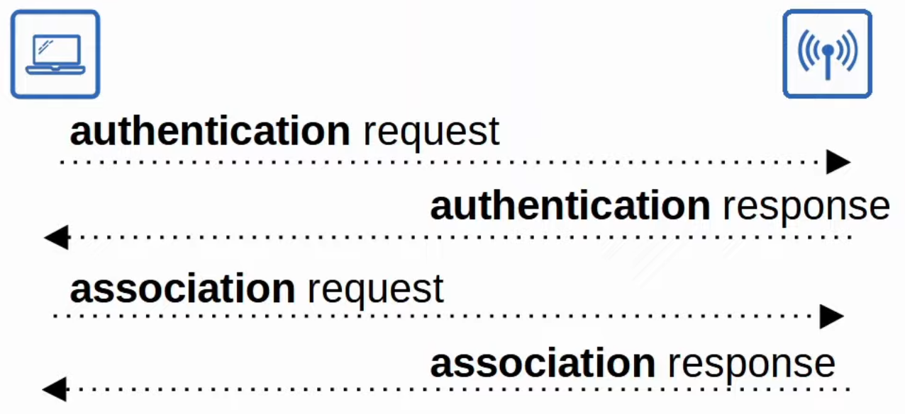
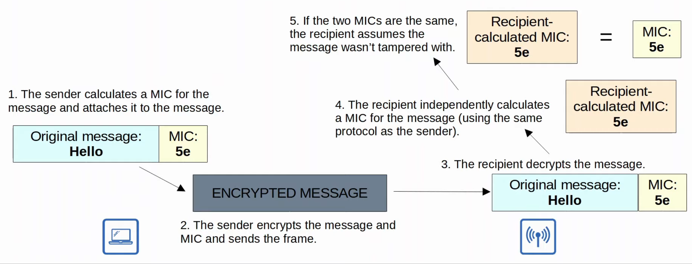
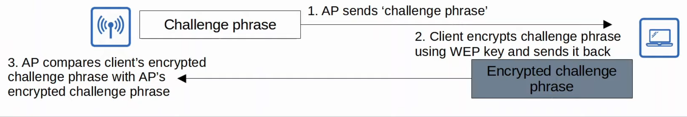
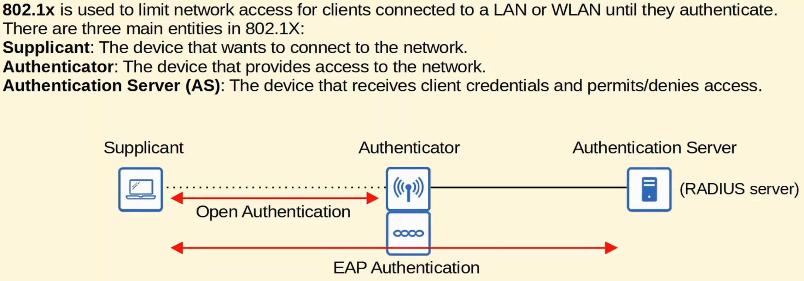
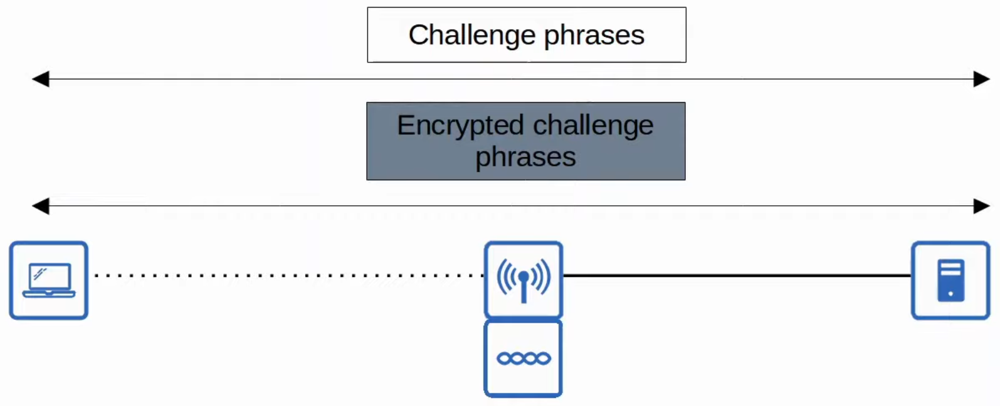
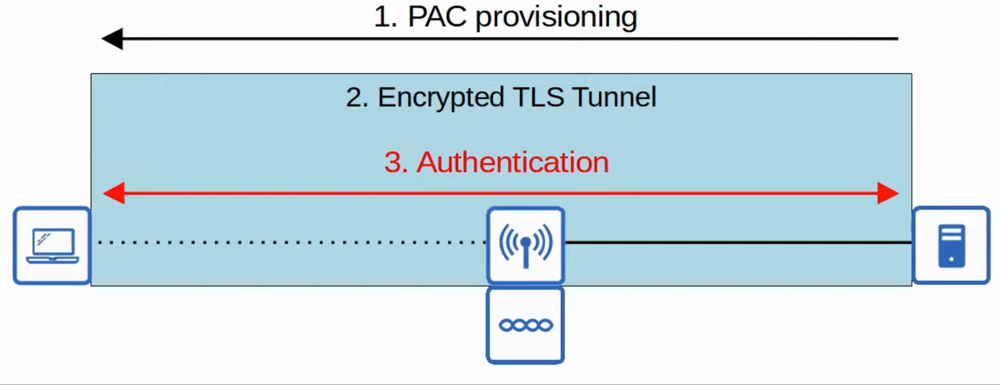
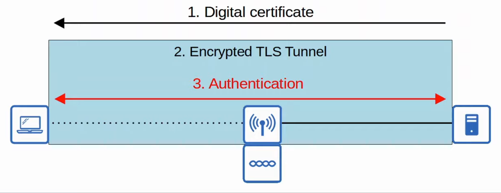
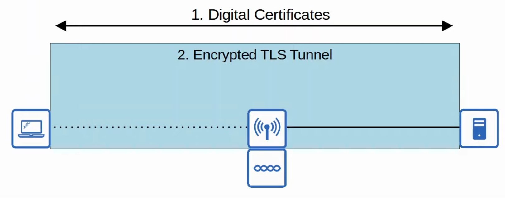

# Wireless Security
### Things We'll Cover
- Intro to wireless network security
- Authentication methods
- Encryption/integrity methods
- Wi-Fi Protected Access (WPA)
### Wireless Network Security
- Because wireless signals are not contained within a wire, any device within range of the signal can receive the traffic
- As a result of that, it's very important to encrypt traffic sent between the wireless clients and the AP
- We will cover three main concepts:
	- Authentication
	- Encryption
	- Integrity
### Authentication
- All clients must be authenticated before they can associate with an AP
- In a corporate setting, only trusted users/devices should be given access to the network
	- In corporate settings, a separate SSID which doesn't have access to the corporate network can be provided for guest users
- Ideally, clients should also authenticate the AP to avoid associated with a malicious AP
- There are multiple ways to authenticate:
	- Password
	- Username/password
	- Certificates

### Encryption
- Traffic sent between clients and APs should be encrypted so that it can't be read by anyone except the AP and the client
- All devices on the WLAN will use the same protocol, however, each client will use a unique encryption/decryption key so that other devices can't read its traffic
- A 'group key' is used by the AP to encrypt traffic that it wants to send to all of its clients
	- All the clients associated with the AP keep that key so they can decrypt the traffic
### Integrity
-  A **MIC (Message Integrity Check)** is added to messages to help protect their integrity

### Authentication Methods
- The original 802.11 standard included two options for authentication:
	- **Open Authentication**
		- The client sends an authentication request, and the AP accepts it (no questions asked!)
		- Not a secure authentication method
		- After the client is authenticated and associated with the AP, it's possible to require the user to authenticate via other methods before access to the network is granted (i.e. Starbucks Wi-Fi)
	- **WEP (Wired Equivalent Privacy)**
		- Is used to provide both authentication and encryption of wireless traffic
		- For encryption, it uses the RC4 algorithm
		- It's a 'shared-key' protocol, requiring the sender and receiver to have the same key
		- WEP keys can be 40 bits or 104 bits in length
		- The above keys are combined with a 24-bit 'IV' (Initialization Vector) to bring the total length to 64 bits or 128 bits
		- WEP encryption is **not secure** and can be easily cracked
		- Can be used for authentication like this:
			
- **EAP (Extensible Authentication Protocol)**
	- Is an authentication framework
	- It defines a standard set of authentication functions that are used by various *EAP Methods*
	- Is integrated with 802.1X, which provides *port-based network access control*
		
- **LEAP (Lightweight EAP)**
	- Was developed by Cisco as an improvement over WEP
	- Clients must provide a username/password to authenticate
	- In addition, *mutual authentication* is provided by both the client and server sending a challenge phrase to each other
	- *Dynamic* WEP keys are used, meaning that the WEP keys are changed frequently
	- Like WEP, LEAP is considered vulnerable and shouldn't be used anymore
		
- **EAP-FAST (EAP Flexible Authentication via Secure Tunneling)**
	- Was also developed by Cisco
	- Consists of three phases:
		1. A PAC (Protected Access Credential) is generated and passed from the server to the client
		2. A secure TLS tunnel is established between the client and authentication server
		3. Inside the secure (encrypted) TLS tunnel, the client and server communicate further to authenticate/authorize the client
		
- **PEAP (Protected EAP)**
	- Like EAP-FAST, PEAP involves establishing a secure TLS tunnel between the client and server
	- Instead of a PAC, the server has a digital certificate
	- The client uses this cert to authenticate the server
	- The cert is also used to establish a TLS tunnel
	- Since only the server provides a cert, the client must still be authenticated within the secure tunnel (i.e. using MS-CHAP)
		
- **EAP-TLS (EAP Transport Layer Security)**
	- Whereas PEAP only requires the AS (Authentication Server) to have a certificate, EAP-TLS requires a cert on the AS and on every single client
	- It's the most secure wireless authentication method, but it's more difficult to implement than PEAP since every client device needs a certificate
	- The TLS tunnel is still used to exchange encryption key information
		
### Encryption & Integrity Methods
- **TKIP (Temporal Key Integrity Protocol)
	- WEP was found to be vulnerable, but wireless hardware at the time was built to use WEP
	- A temporary solution was needed until a new standard was created, and new hardware was built
	- Is used in WPA version 1
	- It adds various security features:
		- A **MIC** is added to protect the integrity of messages
		- A **key mixing algorithm** is used to create a unique WEP key for every frame
		- The **initialization vector** is doubled in length from 24 bits to 48 bits, making brute-force attacks much more difficult
		- The MIC includes the **sender MAC address** to identify the frame's sender
		- A **timestamp** is added to the MIC to prevent replay attacks
			- Replay attacks involve re-sending a frame that's already been transmitted
		- A **TKIP sequence number** is used to keep track of frames sent from each source MAC address
			- This also protects against replay attacks
- **CCMP (Counter/CBC-MAC Protocol)
	- Was developed after TKIP and is more secure
	- It's used in WPA2
	- To use CCMP, it must be supported by the device's hardware
		- Old hardware was only built to use WEP/TKIP and can't use CCMP
	- It consists of two different algorithms to provide encryption and MIC:
		1. **AES (Advanced Encryption Standard) counter mode** encryption
			- It's the most secure encryption protocol current available
			- There are multiple modes of operation, but CCMP uses 'counter mode'
		2. **CBC-MAC (Cipher Block Chaining Message Authentication Code)** is used as a MIC to ensure the integrity of messages
- **GCMP (Galois/Counter Mode Protocol)**
	- Is more secure and efficient than CCMP
	- Its increased efficiency allows higher data throughput than CCMP
	- It's used in WPA3
	- Consists of two algorithms:
		1. **AES counter mode** encryption
		2. **GMAC (Galois Message Authentication Code)** is used as a MIC to ensure the integrity of messages
### Wi-Fi Protected Access
- The Wi-Fi alliance has developed three WPA certifications for wireless devices:
	- WPA
	- WPA2
	- WPA3
- To be WPA-certified, equipment must be tested in authorized testing labs
- All of the above support two authentication modes:
	- **Personal mode:** A pre-shared key (PSK) Is used for authentication
		- When you connect to a home Wi-Fi network, enter the password and are authenticated, that is **personal** mode
		- This is common in small networks
		- The PSK itself is not sent over the air
		- A four-way handshake is used for authentication, and the PSK is used to generate encryption keys
	- **Enterprise mode:** 802.1X is used with an authentication server (RADIUS server)
		- No specific EAP method is specified, so all are supported (PEAP, EAP-TLS, etc.)
- The **WPA** certification was developed after WEP was proven to be vulnerable and includes the following protocols:
	- TKIP (based on WEP) provides encryption/MIC
	- 802.1X authentication (Enterprise mode) or PSK (Personal mode)
- **WPA2** was released in 2004 and includes the following protocols:
	- CCMP provides encryption/MIC
	- 802.1X authentication (Enterprise mode) or PSK (Personal mode)
- **WPA3** was released in 2018 and includes the following protocols:
	- GCMP provides encryption/MIC
	- 802.1X authentication (Enterprise mode) or PSK (Personal mode)
	- Also provides several additional security features:
		- **PMF (Protected Management Frames)**, protecting 802.11 management frames from eavesdropping/forging
		- **SAE (Simultaneous Authentication of Equals)** protects the four-way handshake when using personal mode authentication
		- **Forward secrecy** prevents data from being decrypted after it's been transmitted over the air
			- An attacker can't capture wireless frames and then try to decrypt them later