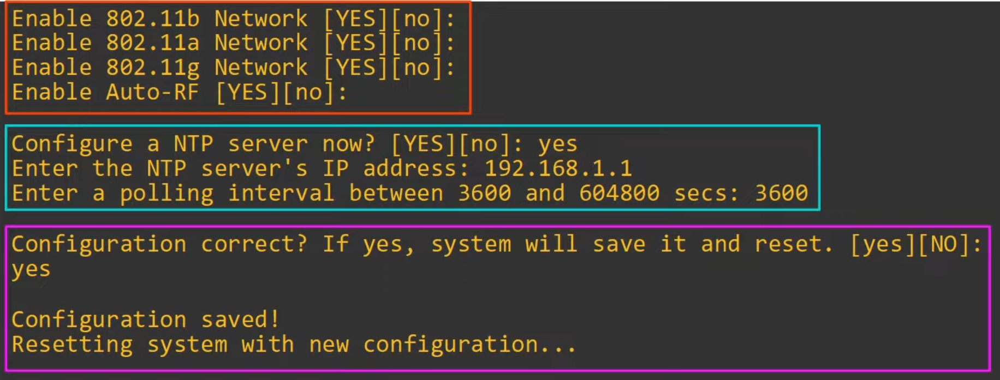

# Wireless Configuration
### Things We'll Cover
- Topology introduction
- Switch configuration
- WLC setup
- WLC interface configuration
- WLAN configuration
- Additional WLC features
### Network Topology

### Switch Configuration

### WLC Initial Setup

- The options in all caps (i.e. NO) will be chosen as the default if you hit enter

### Accessing the GUI

### WLC Ports/Interfaces
- WLC **ports** are the physical ports that cables connect to
- WLC **interfaces** are the logical interfaces within the WLC (i.e. SVIs on a switch)
- WLCs have a few different kinds of **ports**:
	- **Service port:** 
		- A dedicated management port
		- Used for out-of-band management
		- Must connect to a switch access port because it only supports one VLAN
		- This port can be used to connect the device while it's booting, performing system recovery, etc.
	- **Distribution system port:**
		- These are the standard network ports that connected to the 'distribution system' (wired network) and are used for data traffic
		- These ports usually connect to switch trunk ports, and if multiple distribution ports are used they can form a LAG
	- **Console port:**
		- This is a standard console port, either RJ45 or USB
	- **Redundancy port:**
		- This port is used to connect to another WLC to form a high availability (HA) pair

- WLC have a few different kinds of **interfaces:**
	- **Management interface:**
		- Used for management traffic such as Telnet, SSH, HTTP, HTTPS, RADIUS authentication, NTP, Syslog, etc.
		- CAPWAP tunnels are also formed to/from the WLC's management interface
	- **Redundancy management interface:**
		- When two WLCs are connected by their redundancy ports, one WLC is 'active' and the other is 'standby'
		- This interface can be used to connect to and manage the 'standby' WLC
	- **Virtual interface:**
		- This interface is used when communicating with wireless clients to relay DHCP requests, perform client web authentication, etc.
	- **Service port interface:**
		- If the service port is used, this interface is bound to it and used for out-of-band management
	- **Dynamic interface:**
		- These are the interfaces used to map a WLAN to a VLAN
		- For example, traffic from the 'Internal' WLAN will be sent to the wired network from the WLC's 'Internal' dynamic interface
### WLC Configuration
**Interfaces:**

#### Internal WLAN

**Following L3 security options aren't needed for the CCNA:**

- **Web Authentication:**
	- After the wireless clients get an IP address and try to access a web page, they'll have to enter a username and password to authenticate
- **Web Passthrough:**
	- Similar to the above, but no username or password are required
	- A warning or statement is displayed, and the client simply has to agree to gain access to the Internet
- The **Conditional** and **Splash Page** web redirect options are similar, but additionally require 802.1X layer 2 authentication

#### Guest WLAN

- Profile name and SSID don't have to be the same

- Click on the checkbox to enable
- Check the interface group to 'guest'
- The only other change that has to be made is to change the security policy to use PSK instead of 802.1X
- There are a decent amount of steps to create/apply an ACL in the WLC management GUI, but the following is important:

