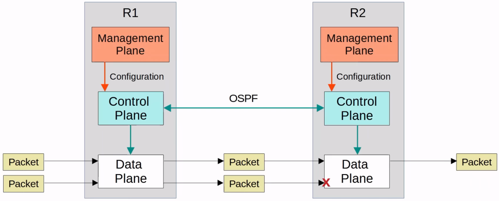
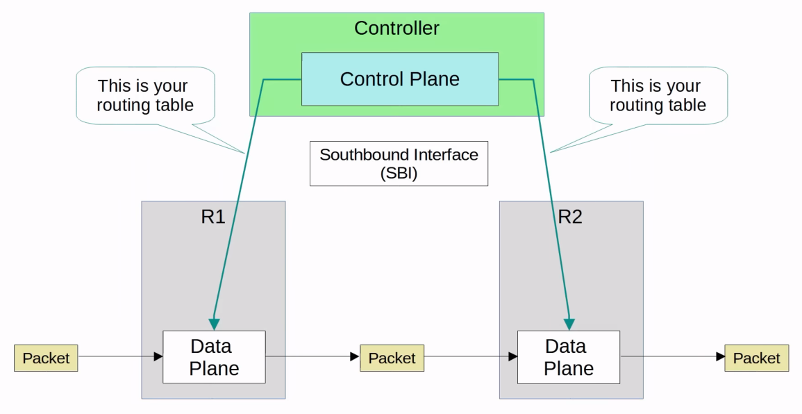
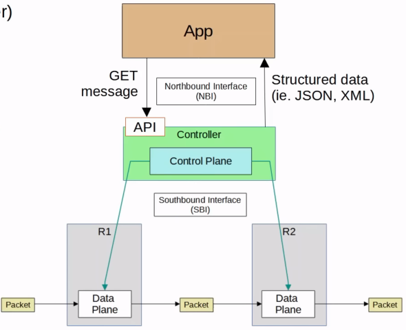

# Network Automation
### Things We'll Cover
- Why network automation?
- Benefits
- Logical 'planes' of network functions
- Software-defined networking (SDN)
- APIs
- Data serialization
### Network Automation
- The current version of the CCNA focuses on the traditional model of managing/controlling networks
- However, CCNA candidates are expected to have a basic understanding of various topics related to network automation
- In the traditional model, engineers manage devices one at a time by connecting to their CLI via SSH
- Some downsides of configuring devices one-by-one:
	- Typos and other small mistakes are common
	- It is time-consuming and very inefficient in large-scal networks
	- It's difficult to ensure that all devices adhere to the org's standard configurations
- Network automation provides many key benefits:
	- Human errors (typos, etc.) is reduced
	- Networks become much more scalable
		- New deployments, network-wide changes, and troubleshooting can be implemented in a fraction of the time
	- Network-wide policy compliance can be assured (standard configurations, software versions, etc.)
	- The improved efficiency of network operations reduces the opex (operating expenses) of the network
		- Each task requires fewer man-hours
- There are various tools/methods that can be used to automate tasks in the network:
	- SDN (Software-Defined Networking)
	- Ansible
	- Puppet
	- Python scripts
	- etc.
### Data Plane
- All tasks involved in forwarding user data/traffic from one interface to another are part of the **data plane** (aka forwarding plane)
- A router receives a message, looks for the most specific matching route in its routing table, and forwards it out of the appropriate interface to the next hop
	- It also de-encapsulates the original Layer 2 header, and re-encapsulates with a new header destines for the next hop's MAC address
- A switch receives a message, looks at the destination MAC address, and forwards it out of the appropriate interface (or floods it)
	- This includes functions like adding or removing 802.1q VLAN tags
- NAT (changing the src/dst addresses before forwarding) is part of the data plane
- Deciding to forward or discard messages due to ACLs, port security, etc. is also part of the data plane
### Control Plane
- How does a device's data plane make its forwarding decisions?
	- Routing table, MAC address table, ARP table, STP, etc.
- Functions that build these tables (and other functions that influence the data plane) are part of the **control plane**
- The control plane *controls* what the data plane does, for example by building the router's routing table
- The control plane performs *overhead* work
	- OSPF itself doesn't forward user data packets, but it informs the data plane about how packets should be forwarded
	- STP itself isn't directly involved in the process of forwarding frames, but it informs the data plane about which interfaces should and shouldn't be used to forward frames
	- ARP messages aren't user data, but they're used to build an ARP table which is used in the process of forwarding data
- In traditional networking, the data plane and control plane are both distributed
- Each device has its own data plane and its own control plane
- The planes are 'distributed' throughout the network
### Management Plane
- Like the control plane, the **management plane** performs overhead work
	- However, the management plane doesn't directly affect the forwarding of messages in the data plane
- It consists of protocols that are used to manage devices
	- SSH/Telnet
	- Syslog
	- SNMP
	- NTP

- The Data plane is the reason we buy routers/switches (and network infrastructure in general), to forward messages
- However, the Control and Management planes are both necessary to enable the data plane to do its job
### Logical Planes
- The operations of the Management Plane and Control plane are usually managed by the CPU
- However, this isn't desirable for Data plane operations because CPU processing is slow (relatively speaking)
- Instead, a specialized hardware **ASIC (Application-Specific Integrated Circuit)** is used
	- ASICs are chips built for specific purposes
- Using a switch as an example:
	- When a frame is received, the ASIC (not the CPU) is responsible for the switching logic
	- The MAC address table is stored in a kind of memory called **TCAM (Ternary Content-Address Memory)**
		- Another common name for the MAC address table is *CAM table*
	- The ASIC feeds the destination MAC address of the frame into the TCAM, which returns the matching MAC address table entry
	- The frame is then forwarded out of the appropriate interface
- Modern routers also use a similar hardware data plane: an ASIC designed for forwarding logic, and tables sotred in TCAM
### Software-Defined Networking
- **SDN** is an approach to networking that centralizes the control plane into an application called a *controller* (i.e. WLC)
- SDN is also called **Software-Defined Architecture (SDA)** or **Controller-Based Networking**
- Traditional control planes use a distributed architecture
	- For example, each router in the network runs OSPF and the routers share routing information and then calculate their preferred routes to each destination
- An SDN controller centralizes control plane functions like calculating routes
	- That is just an example, and how much of the control plane is centralized varies greatly
- The controller can interact programmatically with the network devices using APIs (Application Programming Interface)

- Although this diagram shows a totally centralized control plane, in reality, there are many different solutions
- Some of them centralize the entire control plane, and some of them only centralize some functions
### Southbound Interfaces (SBI)
- The SBI is used for communications between the controller and the network devices it controls
- It typically consists of a communication protocol and API (Application Programming Interface)
- APIs facilitate data exchanges between programs
	- Data is exchanged between the controller and the network devices
	- An API on the network devices allows the controller to access information on the devices, control their data plane tables, etc.
- Some examples of SBIs:
	- OpenFlow
	- Cisco OpFlex
	- Cisco onePK (Open Network Environment Platform Kit)
	- NETCONF
### Northbound Interface (NBI)
- Using the SBI, the controller communicates with the managed devices and gathers information about them:
	- The devices in the network
	- The topology (how the devices are connected together)
	- The available interfaces on each device
	- Their configurations
- The **Northbound Interface (NBI)** is what allows us to interact with the controller, access the data it gathers about the network, program it, and make changes in the network via the SBI
- A *REST API* is used on the controller as an interface for apps to interact with it
	- REST = Representational State Transfer
- Data is sent in a structured (*serialized*) format such as JSON or XML
	- This makes it much easier for programs to use the data

### Automation in Traditional Networks vs SDN
- Networking tasks can be automated in traditional network architectures too:
	- Scripts can be written (i.e. using Python) to push commands to many devices at once
	- Python with good use of Regular Expressions can parse through `show` commands to gather information about the network devices
- However, the robust and centralized data collected by SDN controllers greatly facilitates these functions
	- The controller collects information about all devices in the network
	- Northbound APIs allow apps to access information in a format that's easy for programs to understand (i.e. JSON, XML)
	- The centralized data faciliates network-wide analytics
- SDN tools can provide the benefits of automation without the requirement of third-party scripts & apps
	- You don't need expertise in automation to make use of SDN tools
	- However, APIs allow third-party applications to interact with the controller, which can be very powerful
- Although SDN and automation aren't the same thing, the SDN architecture greatly facilitates the automation of various tasks in the network via the SDN controller and APIs