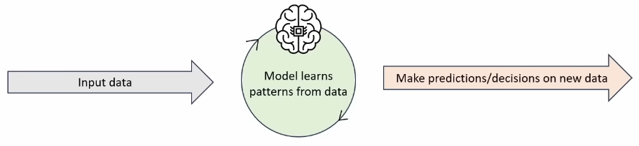

# AI & Machine Learning
### What is AI?
- **Artificial Intelligence (AI)** uses computers to simulate intelligence, allowing them to exhibit behaviors typically associated with humans, such as recognizing patterns, learning, making decisions, and solving problems
### What is ML?
- **Machine Learning (ML)** is a subset of AI that focuses on enabling computers to learn from data and improve without the need for explicit programming
	- Instead of hard-coded instructions (programmed by a human), ML algorithms identify patterns in data and make predictions or decisions based on those patterns

### Types of ML
- **Supervised learning**
	- The model is trained on labeled data, where the correct answers are provided, to make predictions or classifications on new data
- **Unsupervised learning**
	- The model is given unlabeled data and tasked with finding patterns, relationships, or groupings within the data
- **Reinforcement learning**
	- The model learns by interacting with an environment, receiving rewards or penalties based on its actions to maximize its performance over time
- **Deep learning**
	- A specialized subset of ML that uses multi-layered neural networks to handle large datasets and perform complex tasks like image recognition and natural language processing
### Predictive & Generative AI
- **Predictive AI**
	- Uses machines learning to analyze historical data and predict future outcomes or trends
		- Security anomaly detection, weather forecasting
- **Generative AI**
	- Uses machine learning to learn patterns from existing data and create new content, such as text, images, or audio
		- ChatGPT, Gemini, Midjourney, DALL-E, etc.

### Predictive & Generative AI in Networks
- **Predictive AI:**
	- **Traffic forecasting:** Predict network traffic patterns to optimize bandwidth allocation and prevent congestion
	- **Security threat detection:** Identify anomalies or suspicious patterns in real-time to mitigate potential security threats
	- **Predictive maintenance:** Anticipate hardware failures by analyzing historical and current performance data, reducing downtime
- **Generative AI:**
	- **Network documentation:** Generate documentation about network configurations, policies, etc.
	- **Configuration generation:** Automatically generate configurations for network devices based on desired policies and requirements
	- **Network design:** Suggest optimized network layouts or modifications tailored to specific business needs and workloads
	- **Troubleshooting:** Produce solutions or diagnostics based on log files or error messages to resolve issues efficiently
	- **Script generation:** Automatically generate network automation scripts (i.e. Python scripts to configure network devices)
### AI in Cisco Catalyst Center
- Cisco **Catalyst Center** (formerly DNA Center) features a variety of AI-enabled features to identify issues before they impact users, reduce the time required to resolve issues, and increase the performance and security of the network
- Features include...
	- **AI Network Analytics**
		- Uses AI to establish the baseline behavior of the network
		- Provides insights and recommendations for optimizing network performance
		- Continuously monitors the network to detect and predict anomalies
	- **Machine Reasoning Engine (MRE)**
		- Uses AI to perform root-cause analysis when network issues arise
		- Suggests resolutions or takes automated corrective actions without requiring manual intervention
		- Reduces downtime by identifying and resolving issues faster than traditional methods
	- **AI Endpoint Analytics**
		- Identifies and classifies devices on the network, providing detailed visibility
		- Detects unauthorized devices or unusual behavior
		- Simplifies device onboarding by automating profiling and segmentation
	- **AI-enhanced Radio Resource Management (RRM)**
		- Optimizes wireless network performance by dramatically adjusting radio settings
		- Uses AI to load balance, reduce interference, and improve coverage across wireless access points