# Ethernet LAN Switching (Part 2)
### Ethernet Frame
- The **Preamble + SFD** is usually **NOT** considered part of the Ethernet header
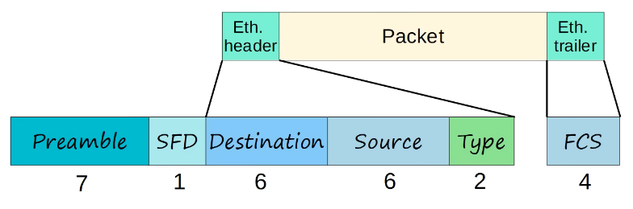
- Therefore the size of the Ethernet header + trailer is 18 bytes (6 + 6 + 2 + 4)
- The minimum size for an Ethernet frame (Header + Payload (Packet) + Trailer) is **64 bytes**
- **64 bytes - 18 bytes** (header + trailer size) = 46 bytes
- Therefore the minimum payload (packet) size is 46 bytes
- If the payload is **less than 46 bytes**, padding bytes are added (i.e. 34-byte packet + 12-byte padding = 46 bytes)
- The Preamble & SFD might not be included as part of the Ethernet header, but they are included with every Ethernet frame
- Also, the minimum size of the frame (64 bytes) does **NOT** Include the Preamble and SFD
### Ethernet LAN Switching
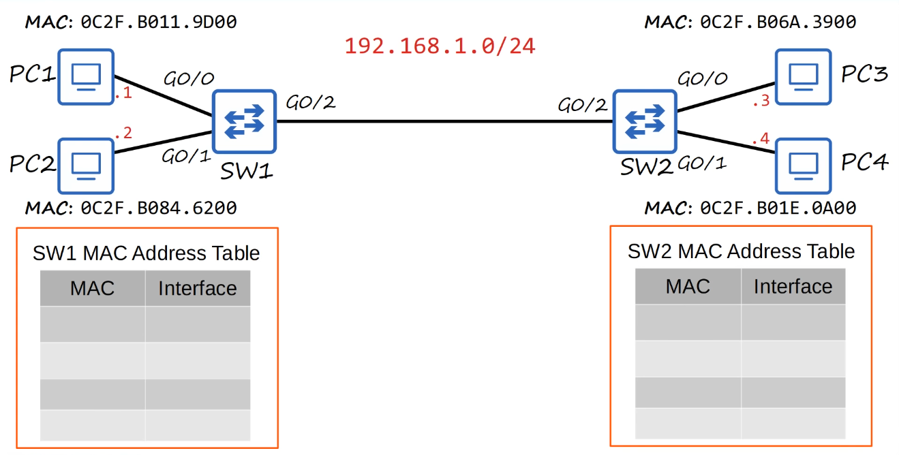
- G0/x represents **Gigabit Ethernet**
- IP addresses are included this time, with `192.168.1.0/24` representing the overall network and the `.x` variants for each PC representing their individual private IPs
- When a device sends some data to another device, it doesn't just include a source and destination MAC address
- Encapsulated within that frame is an IP packet, and that IP packet includes a source and destination IP address
- For example, if PC1 wants to send data to PC3, the source IP will be `192.168.1.1` and the destination IP will be `192.168.1.3`
- The source MAC will be 0CF.B011.9D00, however, PC1 doesn't actually know PC3's MAC address
- When you send data to another computer, you enter the IP address, not the MAC address
- So, the user enters PC3's IP address as the destination, but PC1 has to discover PC3's MAC address by itself
- Remember, switches are Layer 2 devices not Layer 3, so they need to use MAC addresses to communicate between other devices, not IP
- In order for PC1 to learn PC3's MAC address, it uses **ARP (Address Resolution Protocol)**
### ARP (Address Resolution Protocol)
- Is used to discover the Layer 2 address (MAC address) of a known Layer 3 address (IP address)
- Consists of two messages:
	- **ARP Request**
	- **ARP Reply**
- **ARP Request** is **broadcast** = sent to all hosts on the network
- **ARP Reply** is **unicast** = sent only to one host (the host that sent that request)
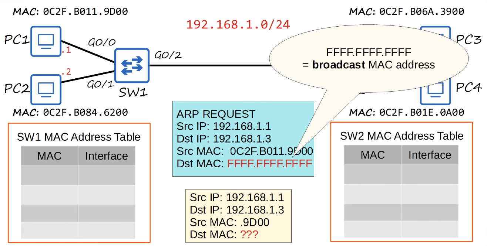
-  First, PC1 has to send PC3 an ARP Request frame
- The broadcast MAC address is the destination MAC address used when a device wants to send ethernet frames to all other devices on the local network
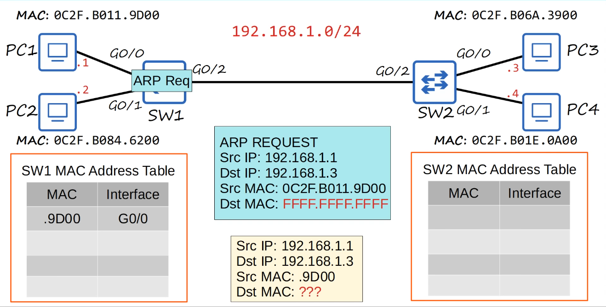
- PC1 sends the ARP request which makes its way to SW1, and SW1 then adds PC1's MAC address to its MAC address table
- This is an example of a **dynamic MAC address**
- Since the destination MAC address is all F's, SW1 broadcasts the frame out of all its interfaces, except the one it was received one
- This is very similar to **flooding** which switches do when receiving an unknown unicast frame
- It sends the frame out of G0/1 and G0/2, but not G0/0 since that's where it received the frame
- PC2 ignores the frame since it doesn't have the same destination IP address as the ARP request
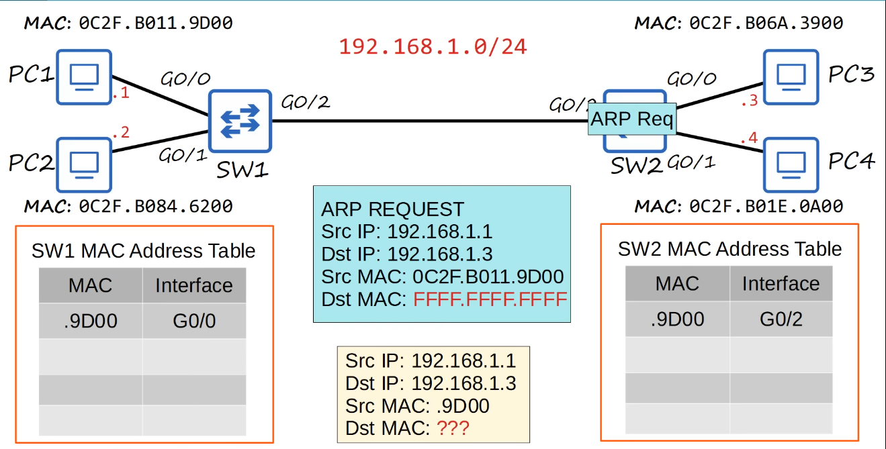
- SW2 then learns PC1's MAC address and adds it to the MAC address table, associating it with the G0/2 interface
- Since the destination MAC address is the broadcast MAC address, SW2 also sends the frame out of all interfaces, except the one the frame was received on
- That means it sends the frame out of G0/0 and G0/1
- PC4 ignores it, but PC3 recognizes that the destination IP address does match its own IP address and doesn't ignore the ARP request
- It now sends the **ARP reply** back to PC1
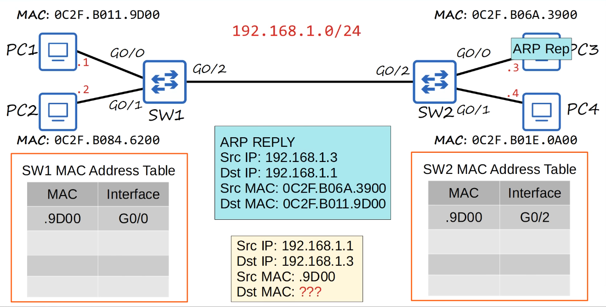
- As shown above, the ARP Reply packet is now fully filled out with both source and destination IP and MAC addresses
- Since PC3 now knows PC1's MAC address, it can send the ARP reply directly to PC1, without having to broadcast the frame
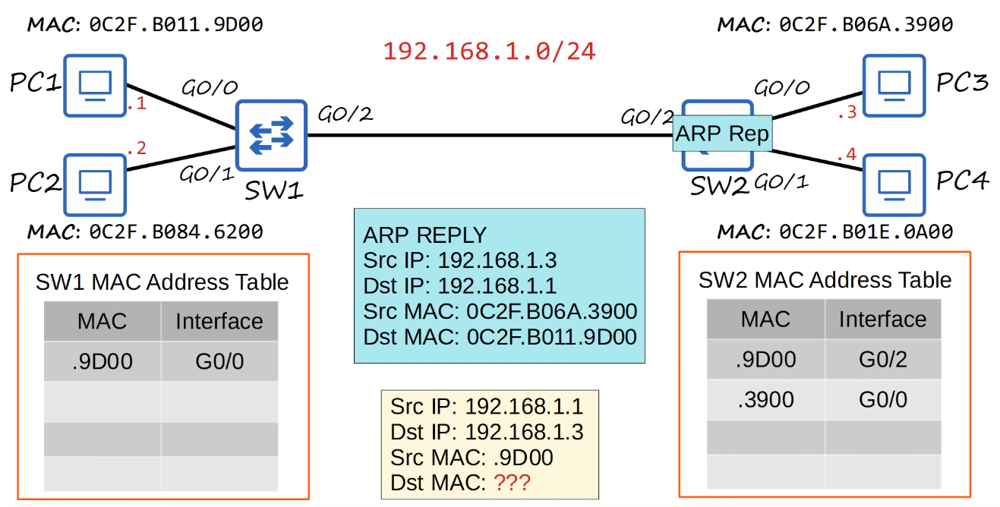
- PC3 sends out the frame which is received by SW2, and SW2 learns and adds PC3's MAC address into its MAC address table
- Since this is a unicast frame, and SW2 already has the destination MAC address in its table, it becomes a **known unicast frame** that can be sent directly to PC1
- The rest of the process is pretty self-explanatory
- Once PC1 receives the ARP reply, it will then use that information to add an entry PC3 to its **ARP table**, which is used to store these IP address to MAC address associations
### ARP Table
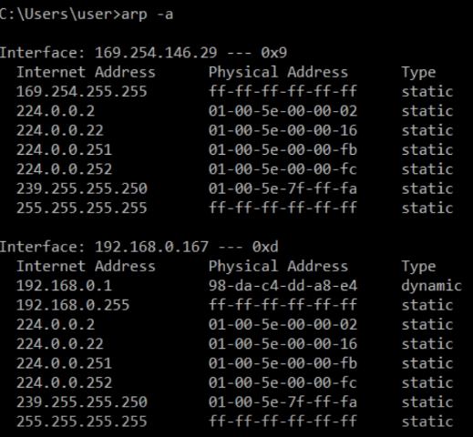
- Use `arp -a` to view the ARP table (Windows, macOS, Linux)
- Internet Address = IP address (Layer 3 address)
- Physical Address = MAC address (Layer 2 address)
- Type static = default entry
- Type dynamic = learned via ARP
### Ping
- A network utility that is used to test reachability
- Measures round-trip time
- Uses two messages:
	- ICMP Echo Request
	- ICMP Echo Reply
	- Both are similar to ARP request & reply, however, the PC won't broadcast the ICMP echo request, it is sent to a specific host
	- It has to know the MAC address of the destination host, which is why ARP must be used first
- Command to use: `ping (ip-address)`
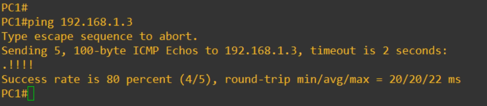
- As showcased in the screenshot above, 5 ICMP echo requests were sent when running ping
- This is the default action of ping, and 5 ICMP replies should be received, and the default size of each ping is 100 bytes
- On line 5, the `.` indicates a failed ping, and the `!` indicates a successful ping
- Why did that first ping fail? That's because of ARP
- PC1 didn't know the destination MAC address, so it had to use ARP, and in that time the first ping failed
- After PC1 learned PC3's MAC address, the pings succeeded
- In Cisco IOS, the command to view the ARP table is `show arp` while in privileged exec mode
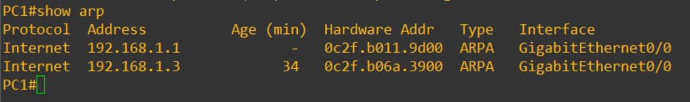
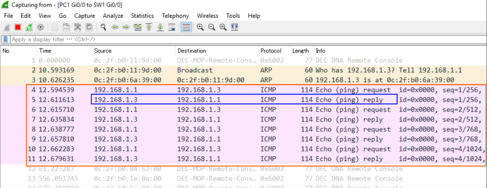
- Within Wireshark, we can see all of this happening in more detail
### MAC Address Table
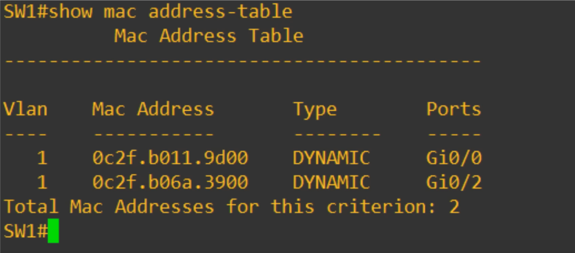
- VLAN (Virtual Local Area Network)
- Ports = Interfaces
- These dynamic MAC addresses are removed from the MAC address table when inactive for 5 minutes
- This concept is known as **aging**
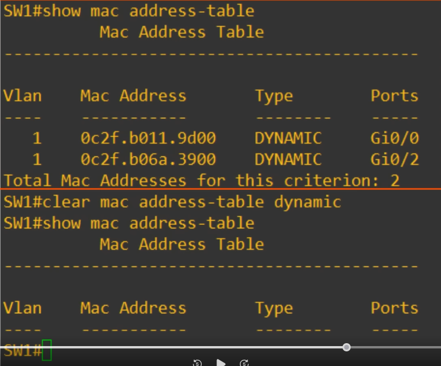
- However, you can also manually remove MAC addresses from the table
- This is done using the command `clear mac address-table dynamic`
- If you don't want to clear all the MAC addresses from the table, you can add some additional options to the command
- For example, `clear mac address-table dynamic address 0c2f.b011.9d00` will only remove that specific MAC address rather than all of them
- Another option is by specifying the interface you'd like to remove, so something like `clear mac address-table dynamic interface Gi0/0`
### Topics We Covered
- Ethernet frame payload minimum size
- ARP (Address Resolution Protocol)
	- ARP Request
	- ARP Reply
- ARP table
- Ping
	- ICMP Echo Request
	- ICMP Echo Reply
- MAC Address Table