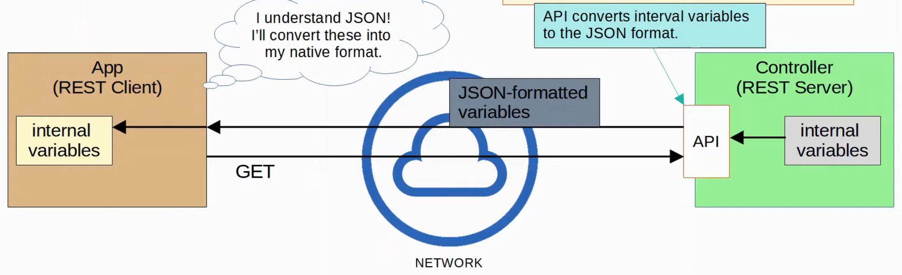
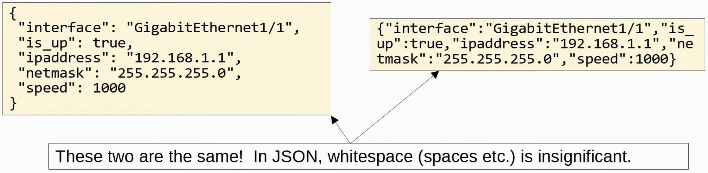
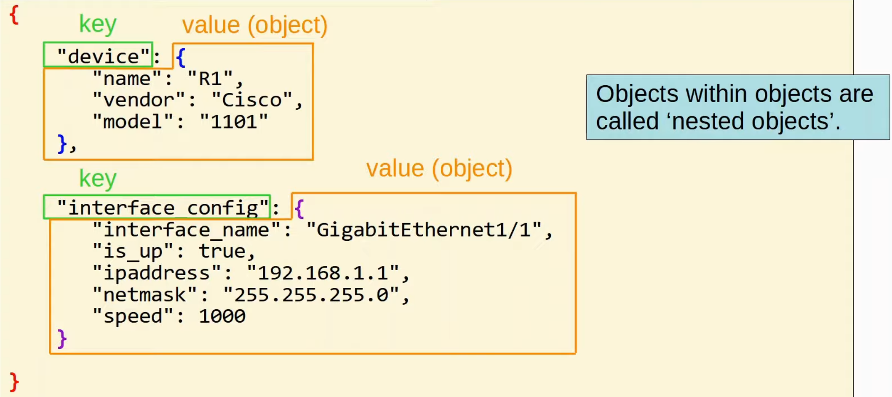
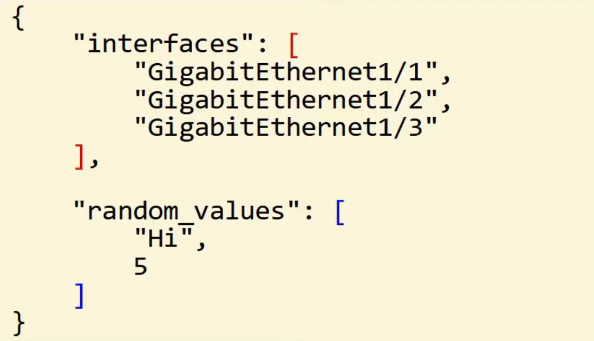
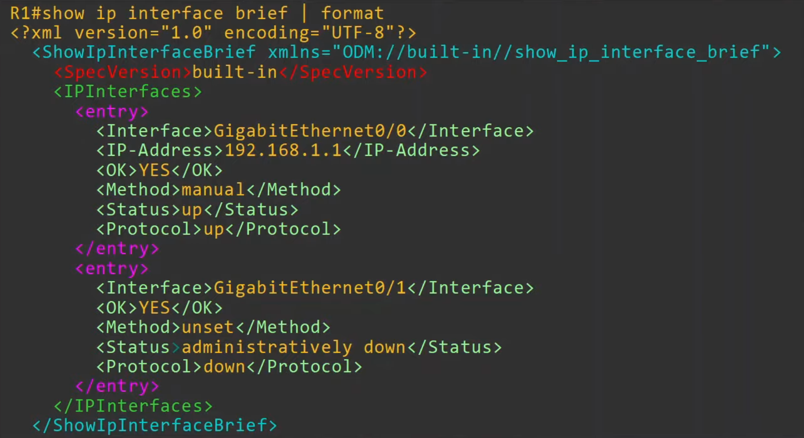
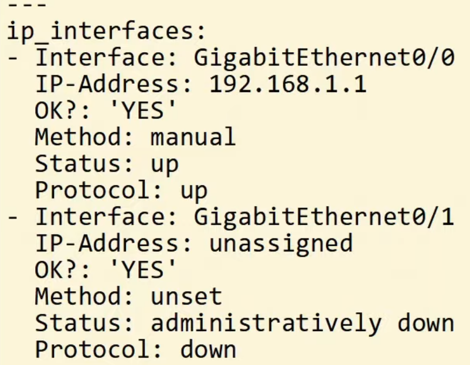

# JSON, XML, & YAML
### Data Serialization
- The process of converting data into a standardized format/structure that can be stored (in a file) or transmitted (over a network) and reconstructed later (i.e. by a different application)
	- This allows the data to be communicated between applications in a way both applications understand
- Data serialization languages allow us to represent *variables* with text
	- *Variables* are containers that store values

### JSON (JavaScript Object Notation)
- Is an open standard **file format** and **data interchange format** that uses human-readable text to store and transmit data objects
- It's standardized in [RFC 8259](https://datatracker.ietf.org/doc/html/rfc8259)
- It was derived from JavaScript, but it's language-independent and many modern programming languages are able to generate and read JSON data
	- REST APIs often use JSON
- *Whitespace* is insignificant
- Can represent four 'primitive' data types:
	- **string**
		- A text value that's surrounded by double quotes " "
	- **number**
		- A numeric value not surrounded by quotes
	- **boolean**
		- A data type that has only two possible values
	- **null**
		- Represents the intentional absence of any object value
- Also has two 'structured' data types:
	- **object**
		- Sometimes called a **dictionary**
		- An unordered list of *key-value pairs* (variables)
		- Are surrounded by curly brackets {}
		- The *key* is a string
		- The *value* is any valid JSON data type
		- The *key* and *value* are separated by a colon :
		- If there are multiple key-value pairs, each pair is separated by a comma
			
			
	- **array**
		- A series of *values* separated by commas
		- Not *key-value* pairs
		- The values don't have to be the same data type
			
### XML (Extensible Markup Language)
- Was developed as a markup language, but is now used as a general data serialization language
	- Markup languages (i.e. HTML) are used to format text (font, size, color, headings, etc.)
- Is generally less human-readable than JSON
- Whitespace is insignificant
- Often used by REST APIs
- `<key>value</key>`

### YAML
- Originally meant *Yet Another Markup Language*
- To distinguish its purpose as a data-serialization language rather than a markup language, it was repurposed to *YAML Ain't Markup Language*
- Is used by the network automation tool Ansible
- Is very human-readable
- Whitespace **is significant** (unlike JSON and XML)
	- Indentation is very important
- YAML files start with ---
- - is used to indicate a list
- Keys and values are represented as key:value

