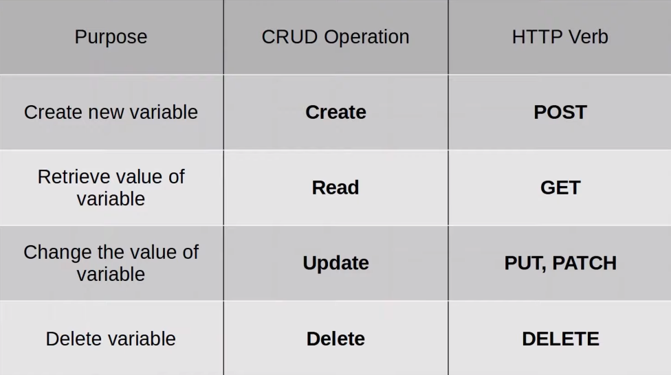
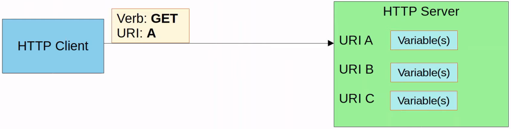

# REST APIs (Application Programming Interface)
- A software interface that allows two apps to communicate with each other
- Are essential not just for network automation, but for all kinds of apps
- In SDN architecture, they're used to communicate between apps and the SDN controller (via the NBI), and between the SDN controller and the network devices (via the SBI)
- The NBI typically uses REST APIs
- NETCONF and RESTCONF are popular southbound APIs
### CRUD
- CRUD (Create, Read, Update, Delete) refers to the operations we perform using REST APIs
- **Create** operations are used to create new variables and set their initial values
- **Read** operations are used to retrieve the value of a variable
- **Update** operations are used to change the value of a variable
- **Delete** operations are used to delete variables
- HTTP uses *verbs* (aka *methods*) that map to these CRUD operations
- REST APIs typically use HTTP
### HTTP Verbs

### HTTP Request
- When an HTTP client sends a request to an HTTP server, the HTTP header includes information like this:
	- An HTTP verb (i.e. GET)
	- A URI (Uniform Resource Identifier), indicating the resource it's trying to access

- Here's an example of a URI:

- The HTTP request can include additional headers which pass additional information to the server
	- Here's a [list](https://developer.mozilla.org/en-US/docs/Web/HTTP/Headers)

- An example would be an **Accept** header, which informs the server about the type(s) of data that can be sent back to the client
	- i.e. `Accept: application/json` or `Accept: application/xml`
- You can also view standard HTTP header fields with some [examples](https://en.wikipedia.org/wiki/List_of_HTTP_header_fields)
- When a REST client makes an API call (request) to a REST server, it'll send an HTTP request like the one above
	- REST APIs don't *have* to use HTTP for communication, although it's the most common choice
### HTTP Response
