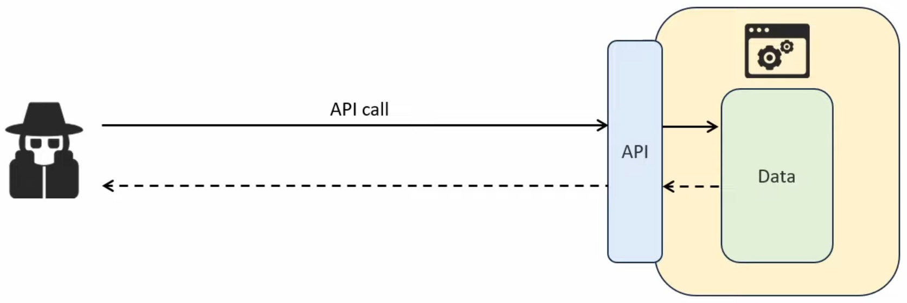
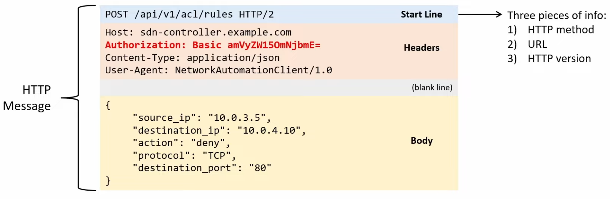
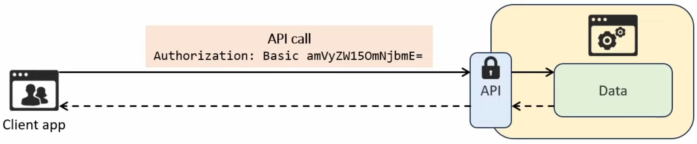
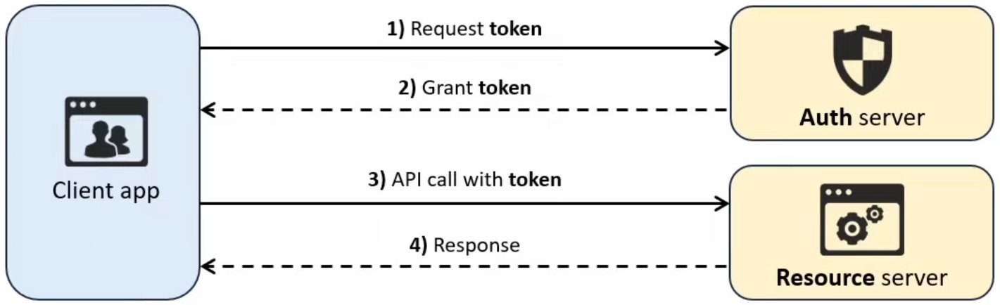
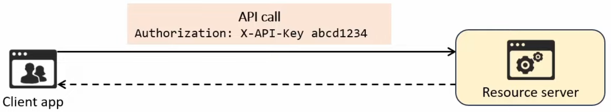
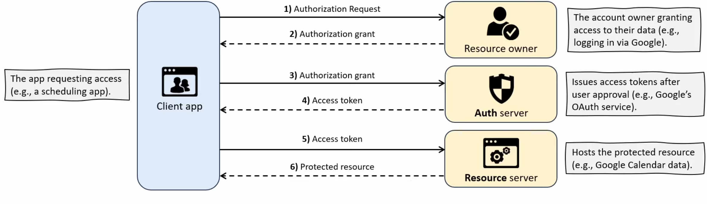

# REST API Authentication
- Without authentication, unauthorized users can send API requests, potentially accessing sensitive data or modifying the application
	- Implementing a reliable authentication method is essential for protecting applications and data

- Many APIs track usage for analytics and billing purposes
### Types of REST API Authentication
- REST APIs use various types of authentication to verify client identity and secure access to resources
	- These are called **methods** or **schemes**
- **Basic authentication**:
	- Sends a username and password in every request, encoded in Base64
- **Bearer authentication:**
	- Uses a token (bearer token) as an HTTP header in each request to verify the client's identity
- **API key authentication:**
	- Requires a unique key, typically included as an HTTP header, to authenticate API requests
- **OAuth2.0:**
	- A secure framework that grants access via access tokens, commonly used for delegated access and third-party authentication
### Basic Authentication

- The username/password are sent in the format *username:password* encoded in Base64

- **Advantages:**
	- Simple and easy to implement
- **Disadvantages:**
	- Since credentials are sent in every request, attackers could steal them if the connection is not properly secured
	- Even if using HTTPS for encryption, relying solely on a username/password combination isn't particularly secure
### Bearer Authentication
- Uses a **token** instead of a username/password
	- The client first obtains a token by authenticating with an authorization server
		- This can be done using **Basic authentication** or another method
	- For each API call, the client includes the token in the HTTP Authorization header
		- `Authorization: Bearer ya29.a0ARrdaM8`

- The term **bearer** means that anyone who possesses the token can uses it
	- If an attacker steals the token, they can make API calls as if they were the legitimate user
	- To mitigate against this, **tokens expire** after a set period of time
- **Advantages:**
	- More secure than **Basic authentication** (no need to transmit the same username/password for every API call)
	- Tokens expire, so a stolen token will only be temporarily valid
- **Disadvantages:**
	- If a token is stolen, the attacker can access the API until it expires
	- Tokens need to be refreshed periodically, adding extra complexity to implement
	- Should only be used with HTTPS
### API Key Authentication
- Uses a **static key** issued by the API provider
	- The client uses this key in each API call for authentication
	- Unlike **bearer tokens**, the **API key** is static and remains valid until revoked
- API Keys can be sent in:
	- The HTTP authorization header (recommended)
	- The URL (i.e. add `?api_key=abc123` to the end of the URL)
		- Not recommended! URLs are often logged by web servers, proxies, browsers, etc.
	- A cookie (sometimes uses for browser-based APIs)

- **Advantages:**
	- Easier to implement than Bearer authentication (no need to refresh tokens)
	- Good for tracking API usage
		- Often uses by cloud services and third-party APIs
- **Disadvantages:**
	- If stolen, the key grants full access until revoked
	- API keys must be rotated manually to maintain security, whereas tokens expire automatically
### OAuth2.0
- A secure authentication framework that is widely used in modern web applications
	- It provides *access delegation*, granting third-party applications **limited access** to resources on behalf of the resource's owner
		- There is no need to share the resource owner's credentials with the third party
- Examples of OAuth2.0:
	- Logging in with Google
	- Connecting apps to social media accounts
	- Calendar integration
- The authentication/authorization process consists of six steps:
	1. The **client app** requests authorization from the resource owner (you) to access the resource (your Google Calendar data)
	2. The **resource owner** grants authorization by logging into their account (i.e. Google account) and giving permission
	3. The **client app** exchanges the authorization grant for an access token from the auth server
	4. The **auth server** provides an access token to the client app
	5. The **client app** sends the access token to the resource server (e.g., Google' server hosting calendar data) to request the resource
	6. The **resource server** validates the access token and provides the requests resource (calendar data) to the client app

- The **access token** granted in step 4 functions just like the token used in **bearer authentication**
	- It grants access to the specified resource within the appropriate scope of access (i.e. read-only access)
	- Access tokens expire after a short period, but OAuth2.0 uses **refresh tokens** (granted by the Auth server) to obtain new access tokens without requiring the user to log in every time
