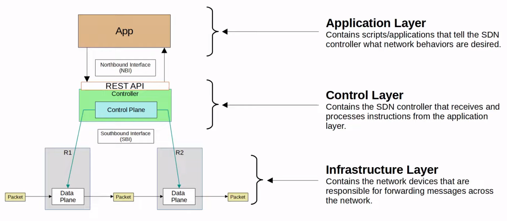
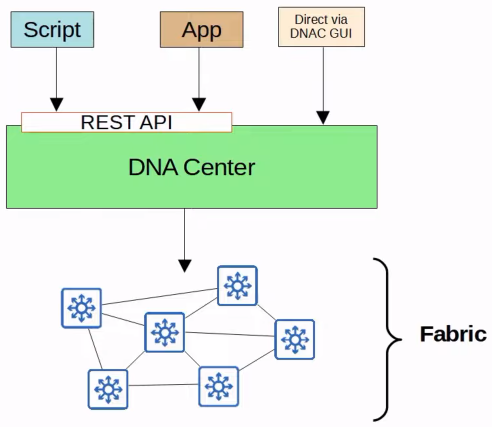
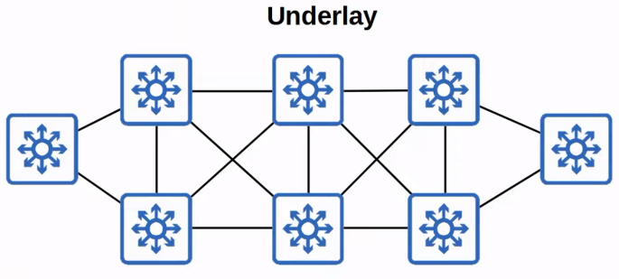
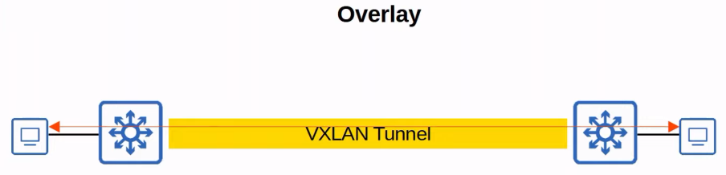
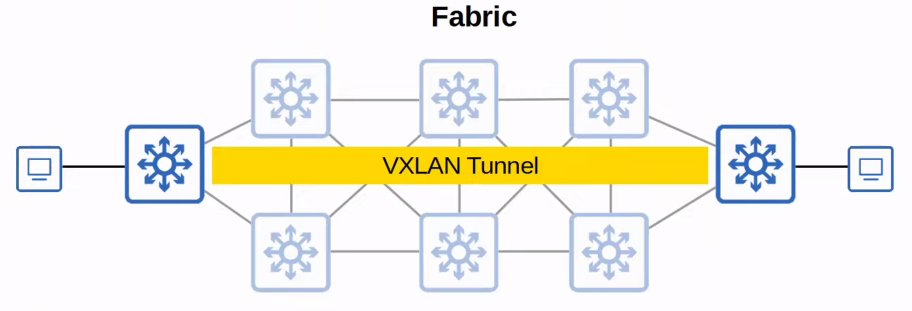
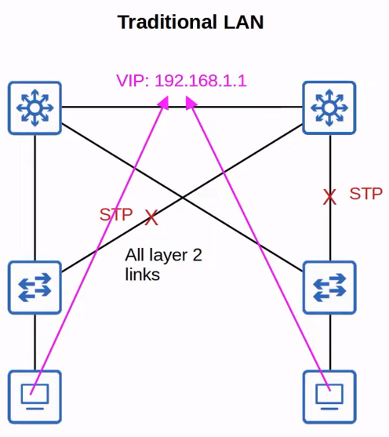
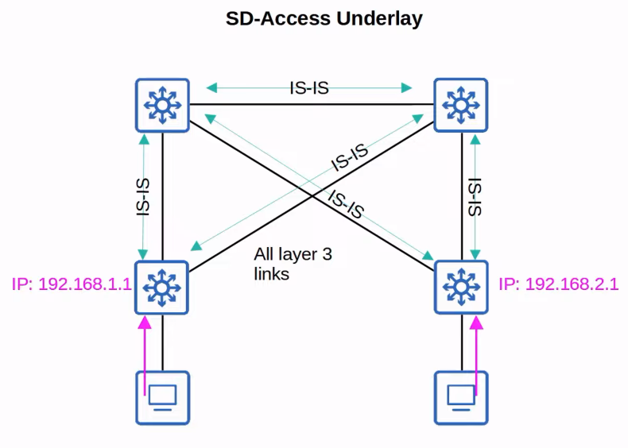
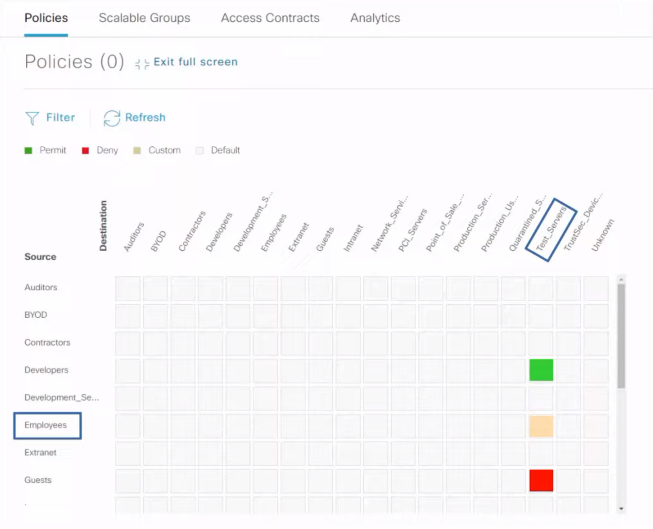

# Software-Defined Networking
### SDN Review
- An approach to networking that centralizes the control plane into an application called a *controller*
- Traditional control planes use a distributed architecture
- An SDN controller centralizes control plane functions like calculating routes
- The controller can interact programmatically with the network devices using APIs
- The **SBI** is used for communications between the controller and the network devices it controls
- The **NBI** is what allows us to interact with the controller with our scripts and applications
### SDN Architecture

### SD-Access
- Cisco's **SD-Access** is Cisco's SDN solution for automating campus LANs
	- ACI (Application Centric Infrastructure) is their SDN solution for automating data center networks
	- SD-WAN is their SDN solution for automating WANs
- Cisco's **DNA (Digital Network Architecture) Center** is the controller at the center of SD-Access

- The **underlay** is the underlying physical network of devices and connections (including wired and wireless) which provide IP connectivity (i.e. using IS-IS)
	- Multilayer switches and their connections
- The **overlay** is the virtual network built on top of the physical underlay network
	- SD-Access uses VXLAN (Virtual Extensible LAN) to build tunnels
- The **fabric** is the combination of the overlay and underlay; the physical and virtual network as a whole

### Underlay
- The underlay's purpose is to support the VXLAN tunnels of the overlay
- There are three different roles for switches in SD-Access:
	- **Edge nodes:** Connect to end hosts
	- **Border nodes:** Connect to devices outside the SD-Access domain, i.e. WAN routers
	- **Control nodes:** Use LISP (Locator ID Separation Protocol) to perform various control plane functions
- You can add SD-Access on top of an existing network (*brownfield deployment*) if your network hardware and software supports it
	- In this case, DNA Center won't configure the underlay
- A new deployment (*greenfield deployment*) will be configured by DNA Center to use the optimal SD-Access underlay:
	- All switches are Layer 3 and use IS-IS as their routing protocol
	- All links between switches are routed ports (this means STP isn't needed)
	- Edge nodes (access switches) act as the default gateway of end hosts (*routed access layer*)

### Overlay
- LISP provides the control plane of SD-Access
	- A list of mappings of EIDs (endpoint identifiers) to RLOCs (routing locators) is kept
	- EIDs identify end hosts connected to edge switches
	- RLOCs identify the edge switch which can be used to reach the end host
- Cisco TrustSec (CTS) provides policy control (QoS, security policy, etc.)
- VXLAN provides the data plane of SD-Access
### Cisco DNA Center
- Has two main roles:
	- The SDN controller in SD-Access
	- A network manager in a traditional network (non-SD-Access)
- Is an application installed on Cisco UCS server hardware
- It has a REST API which can be used to interact with DNA center
- The SBI supports protocols such as NETCONF and RESTCONF (as well as traditional protocols like Telnet, SSH, SNMP)
- Enables *Intent-Based Networking* (IBN)
	- The goal is to allow the engineer to communicate their intent for network behavior to DNA Center
	- DNA center will take care of the details of actual configurations and policies on the devices
- For example, traditional security policies using ACLs can become VERY cumbersome
	- ACLs can have **thousands** of entries
	- The intent of entries is forgotten with time and as engineers leave and new ones take over
	- Configuring and applying the ACLs correctly across a network is cumbersome and leaves room for error
- DNA Center allows the engineer to specify the intent of the policy (this group of users can't communicate with a different group, etc.) and DNA Center will take care of the exact details of implementing it

- Engineer can write an explanation for each policy made, making it easier to understand later
- To play around with DNA center, we can go to the following [website](sandboxdnac.cisco.com)
	- User: devnetuser
	- Password: Cisco123!
### DNA Center vs Traditional Network Management
- Traditional network management:
	- Devices are configured one-by-one via SSH or console connection
	- Configurations and policies are managed per-device (distributed)
	- New network deployments can take a long time due to the manual labor required
	- Errors and failures are more likely due to increased manual effort
- DNA Center-based network management:
	- Devices are centrally managed and monitored from the DNA Center GUI or other applications using its REST API
	- The admin communicates their intended network behavior to DNA Center, which changes those intentions into configurations on the managed network devices
	- Configurations and policies are centrally managed
	- Software versions are also centrally managed,
		- DNA Center can monitor cloud servers for new versions and then update the managed devices
	- New network deployments are much quicker
		- New devices can automatically receive their configurations from DNA Center without manual configuration
