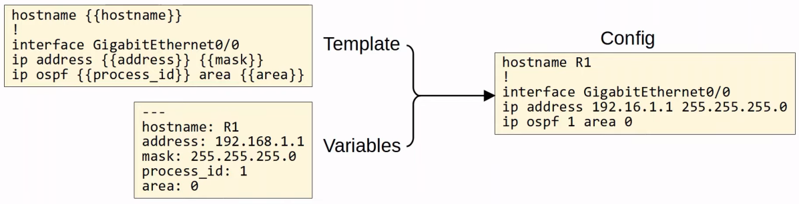
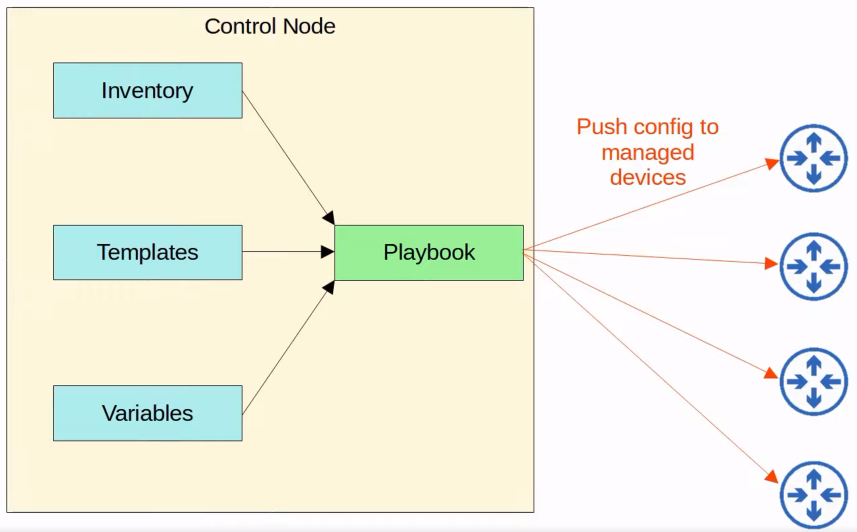
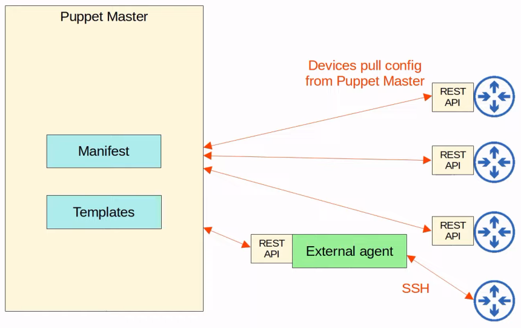
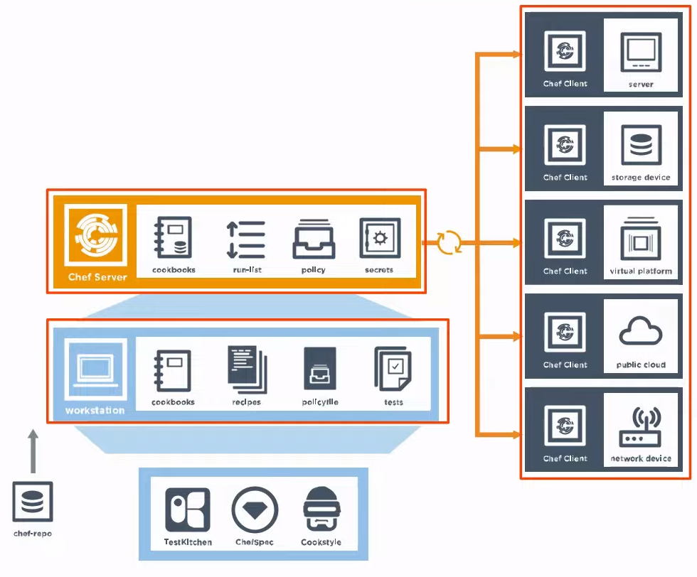
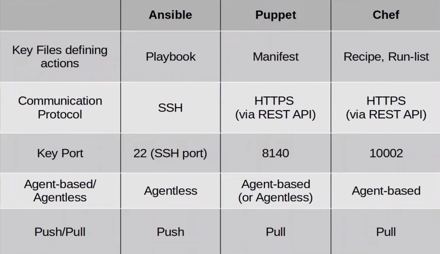

# Ansible, Puppet, Chef
### Configuration Drift
- When individual changes made over time cause a device's configuration to deviate from the standard/correct configurations as defined by the company
	- Although each device will have unique parts of its configuration (IP addresses, host name, etc.), most of a device's configuration is usually defined in standard templates designed by the network engineers of the company
	- As individual engineers make changes to devices (i.e. troubleshooting and fixing network issues, test configurations, etc.), the configuration of a device can drift away from the standard
	- Records of these individual changes and their reasons aren't kept
	- This can lead to future issues
- Even without automation tools, it's best to have standard *configuration management* practices
	- When a change is made, save the config as a text file and place it in a shared folder
	- A standard naming system like `hostname_yyyymmdd` might be used
	- There are flows to this system, as an engineer might forget to place the new config in the folder after making changes
		- Which one should be considered the 'correct' config?
	- Even if configurations are properly saved like this, it doesn't guarantee that they actually match the standard
### Configuration Provisioning
- Refers to how config changes are applied to devices
	- This includes configuring new devices, too
- Traditionally, configuration provisioning is done by connecting to devices one-by-one via SSH
	- This is not practical in large networks
- Configuration management tools like Ansible, Puppet, and Chef allow us to make changes to devices on a mass scale with a fraction of the time/effort
- Two essential components: *templates* and *variables*

### Configuration Management Tools
- Network automation tools that facilitate the centralized control of large numbers of network devices
- The options you need to be aware of for the CCNA are Ansible, Puppet, and Chef
- These tools were originally developed after the rise of VMs, to enable server system admins to automate the process of creating, configuring, and removing VMs
	- However, they're also widely used to manage network devices
- These tools can be used to perform tasks such as:
	- Generate configurations for new devices on a large scale
	- Perform configuration changes on devices (all devices in your network, or a certain subset of devices)
	- Check device configurations for compliance with defined standards
	- Compare configurations between devices, and between different versions of configurations on the same device
### Ansible
- A configuration management tool owned by Red Hat
- Written in Python
- Is *agentless*
	- Doesn't require any special software to turn on the managed devices
- Uses SSH to connect to devices, making configuration changes, extract information, etc.
- Uses a *push* model
	- The Ansible server (Control node) uses SSH to connect to managed devices and *push* configuration changes to them
	- Puppet and Chef use a *pull* model
- After installing Ansible, you must create several text files:
	- **Playbooks:**
		- Files that serve as 'blueprints of automation tasks'
		- Outline the logic and actions of the tasks that Ansible should do
		- Written in YAML
	- **Inventory:**
		- These files list the devices that will be managed by Ansible, as well as characteristics of each device such as their device role (access switch, WAN router, firewall, etc.)
		- Written in INI, YAML, or other formats
	- **Templates:**
		- These files represent a device's configuration file, but specific values for variables aren't provided
		- Written in Jinja2 format
	- **Variables:**
		- These files list variables and their values
		- These values are substituted into the templates to create complete configuration files
		- Written in YAML

### Puppet
- A config management tool written in Ruby
- Is typically agent-based
	- Specific software must be installed on the managed devices
	- Not all Cisco devices support a Puppet agent
- Can be run agentless, in which a proxy agent runs on an external host, and the agent uses SSH to connect to the managed devices and communicate with them
- The Puppet server is called the 'Puppet master'
- Uses a pull model (clients 'pull' configurations from the Puppet master)
	- Clients use TCP 8140 to communicate with the Puppet master
- Instead of YAML, it uses a proprietary language for files
- Text files required on the Puppet master include:
	- **Manifest:** This file defines the desired config state of a network device
	- **Templates:** Similar to Ansible templates, used to generate Manifests

### Chef
- Also written in Ruby
- Is agent-based
	- Most Cisco devices don't support it
- Uses a pull model
- The server uses TCP 10002 to send configurations to clients
- Files use a DSL (Domain-Specific Language) based on Ruby
- Text files used by Chef include:
	- **Resources:**
		- The 'ingredients' in a recipe
		- Config objects manage by Chef
	- **Recipes:**
		- The 'recipes' in a cookbook
		- Outline the logic and actions of the tasks performed on the resources
	- **Cookbooks:**
		- A set of related recipes grouped together
	- **Run-list:**
		- An ordered list of recipes that are run to bring a device to the desired config state

### Comparison

