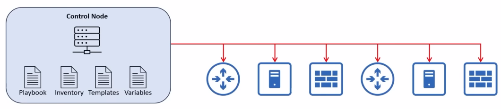
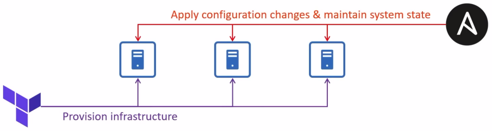
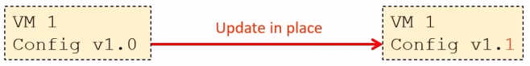
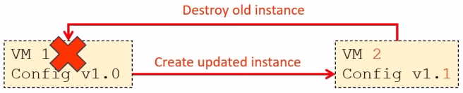
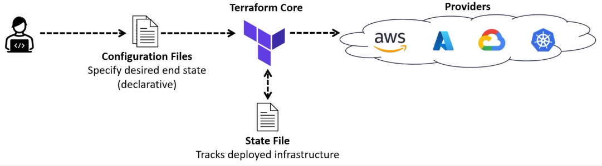

# Terraform
### Infrastructure as Code (IaC)
- The practice of provisioning and managing infrastructure (servers, networks, cloud resources) using machine-readable config files (code) instead of manual configuration (CLI/GUI)
- Ansible, Puppet, and Chef are examples of IaC config management tools
	- Ansible manages devices configurations using several files
		
- **Terraform** is an IaC-based provisioning tool that automates the creation of infrastructure resources
- IaC automates infrastructure deployment and management, ensuring consistency, scalability, and repeatability
### Provisioning vs Management
- **Configuration management** (Ansible, Puppet, Chef)
	- Manages existing infrastructure by installing software, configuring settings, and maintaining system state
	- Ensures consistency by applying and enforcing configurations across multiple devices
- **Infrastructure provisioning** (Terraform)
	- Creates, modifies, and deletes infrastructure resources such as servers and network infrastructure
	- Focuses on initial setup rather than ongoing config management
- Config management tools work on **already existing systems**, whereas provisioning tools **build infrastructure from scratch**
- **Terraform** and **Ansible** can work together:
	- Terraform provisions infrastructure (VMs, networks, storage, etc.)
	- Ansible provides ongoing configuration and management

### Mutable vs Immutable Infrastructure
- Config management tools typically use a **mutable infrastructure** approach
	- Infrastructure can be modified after deployment (i.e. applying updates, patches, or configuration changes)
	- Changes are made *in place*, meaning existing resources are updated rather than replaced

- Provisioning tools employ an **immutable infrastructure** approach
	- Infrastructure can't be changed after deployment
		- "Changes" involve replacing the previous resource with a new version
	- No **configuration drift**, since each deployment starts from a fresh, predefined state

### Procedural vs Declarative
- **Procedural approach** (AKA Imperative)
	- Follows **explicit steps** in a **specific order** to achieve the desired outcome
	- The user must define each action to configure the infrastructure
	- Provides greater control compared to a declarative approach
- **Declarative approach**
	- Defines the **desired end state**
	- The tool (i.e. Terraform) figures out the steps needed to achieve this goal
	- Easier to maintain and ensures consistency across deployments
- A **procedural** approach focuses on **how** to make changes (explicit steps)
	- "Configure router's hostname with `hostname R1`"
	- "Configure the IP address of G0/1 with `ip address 192.168.1.1 255.255.255.0`"
	- "Enable the interface with `no shutdown`"
	- etc.
- A **declarative** approach focuses on **what** the final state should be
	- "Create a router named R1 with IP address 192.168.1.1/24 on its G0/1 interface, ensuring the interface is enabled"

### Terraform
- An open-source IaC tool developed by HashiCorp (acquired by IBM in 2025)
- It is primarily a **provisioning** tool, focused on deploying infrastructure resources on various cloud & on-prem platforms
	- These platforms are called **providers** and include AWS, Azure, GCP, Kubernetes, and many more
		- This includes integrations with Cisco platforms like **Catalyst Center**, **ACI**, and **IOS XE**
- Like Ansible, Terraform uses a **push** model and is **agentless**; it doesn't require a software agent on infrastructure it provisions or manages

- The basic Terraform workflow consists of three main steps:
	- **Write:** Define the desired state of your infrastructure resources in configuration files
	- **Plan:** Verify the changes that will be executed before applying them
	- **Apply:** Execute the plan to provision and manage the infrastructure resources
- While Terraform Core is written in **Go**, config files are written in **HashiCorp Configuration Language (HCL)**
	- HCL is an example of a **domain-specific language (DSL)**, a type of language specialized for a particular purpose
		- Because DSLs are specialized, they allow users to perform complex tasks with much less effort than a general language (like Python or Go) would require
### 