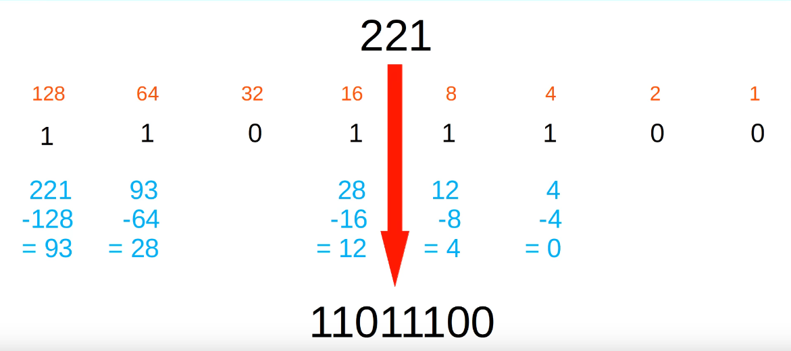
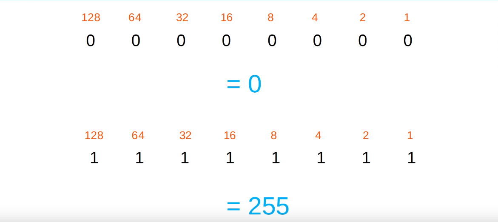
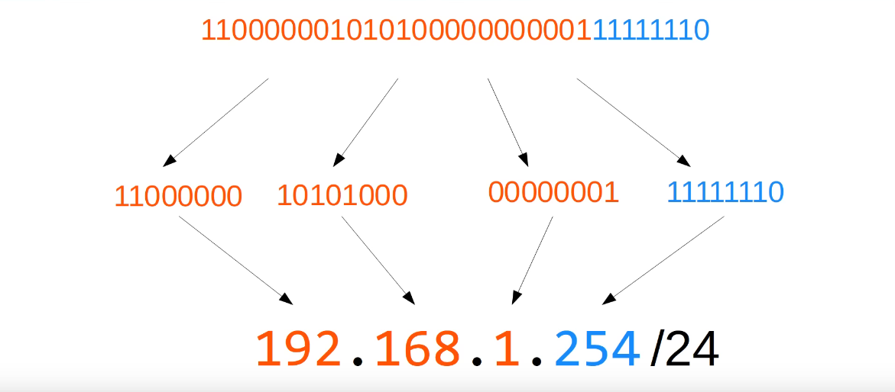
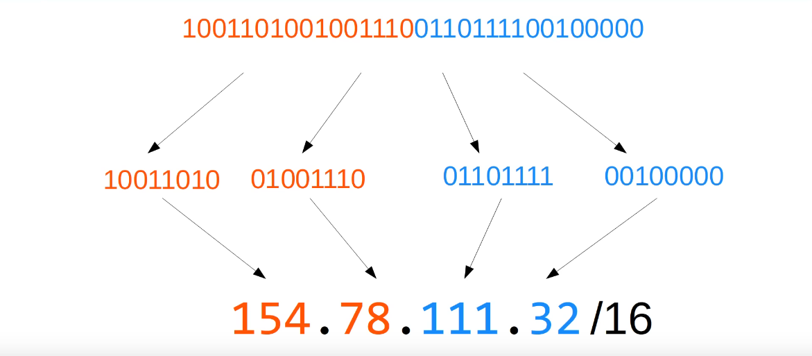
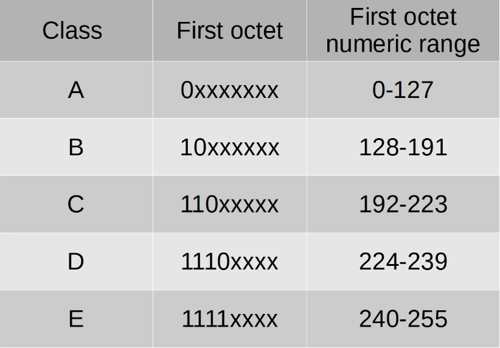
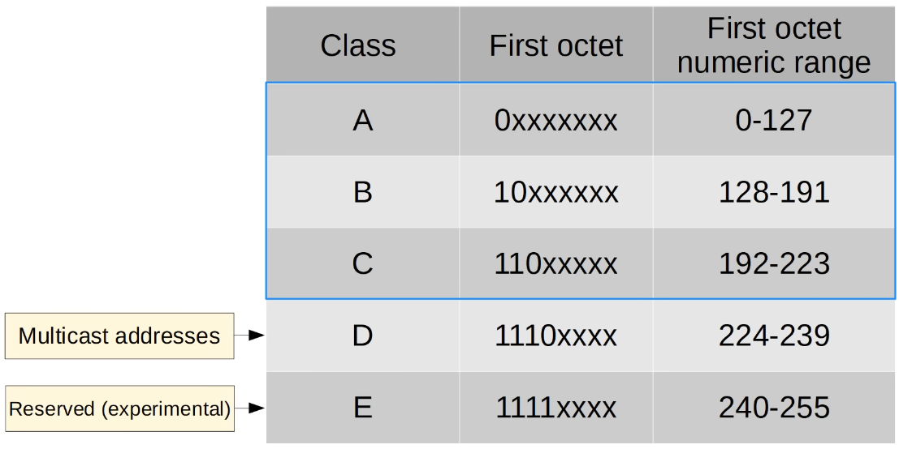
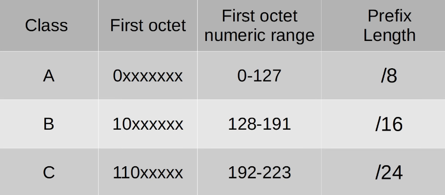
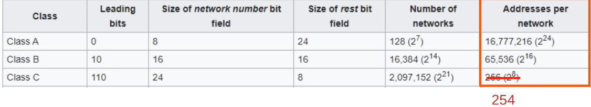
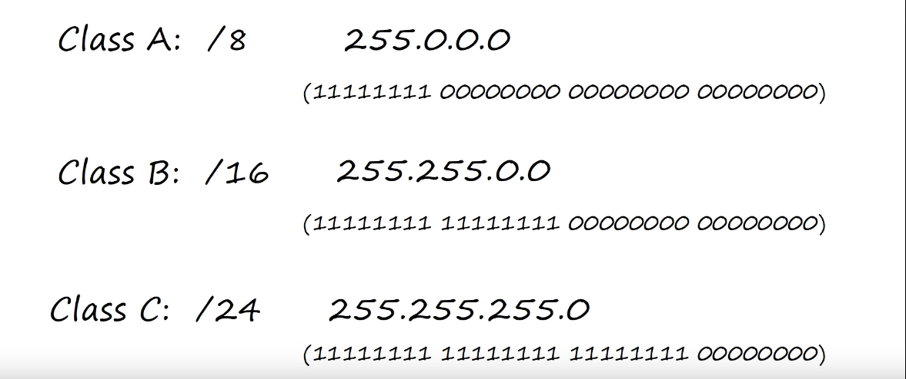
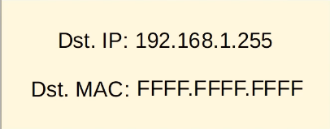

### Decimal -> Binary

- Write out all the octet values and subtract them from the decimal lover starting from left to right until we end up with zero
### Binary Range

### IPv4 Addresses

- An IPv4 address is really a series of 32 bits, split up into 4 octets, and then written in dotted decimal format to make it simpler to read and understand
- Since an IP address is 32 bits, the /24 means that the first 24 bits of this IP address represent the network portion of the address, and the remaining 8 represent the end host
- So, the first 24 bits is equal to the first 3 octets, because 8+8+8=24
- So 192.168.1 is the network portion of the address, and 254 is the host portion

- In this case, the /16 at the end means that the first 16 bits of the address represents the network portion, and the remaining half represents the host portion
### IPv4 Address Classes

- We will be primarily focusing on the first 3 classes, as they represent unicast and broadcast addresses that've already been discussed in the previous lectures
- It's also worth mentioning that the end of the class A range is usually considered to be 126, not 127
### Loopback Addresses
- Address range 127.0.0.0-127.255.255.255
- Used to test the 'network stack' (think OSI, TCP/IP model) on the local device
### IPv4 Address Classes

- These are the only classes we'll be focusing on for now
- The chart now includes the prefix length for each class

- This chart shows the total number of possible networks and hosts for each of these 3 classes
- Since the first address in each network is the network address, and the last network address is the broadcast address, neither can be assigned to a network/host
- So really the numbers displayed would be two less
### Netmask

- While the slash notation is easy to read/understand, it's still a relatively new concept
- Cisco instead uses netmasks as displayed on the right, but they mean the same thing as the slashes
### Network Address
- If the **host portion** of the address is all 0's, this means it's the **network address**
- The **network address** CANNOT Be assigned to a host (no host can have their IP end in .0)
### Broadcast Address
- If the **host portion** of the address is all 1's, this means it's the **broadcast address**
- The **broadcast address** CANNOT Be assigned to a host
- The broadcast address is the layer 3 address used to send a packet to all hosts on the local network

### Review
- Dotted decimal & binary
- Network portion/host portion of IPv4 addresses
- IPv4 address classes
- Prefix lengths/netmasks
- Network addresses/broadcast addresses