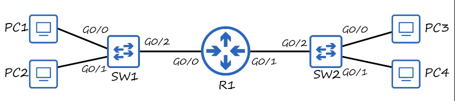
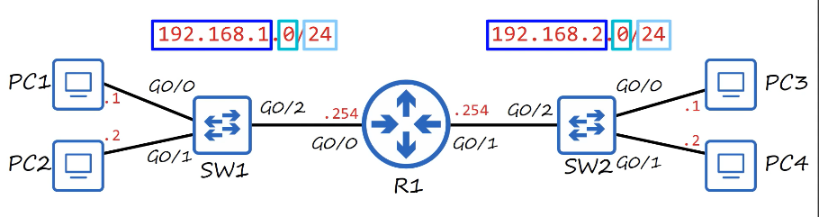
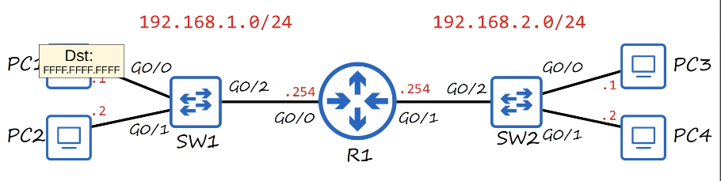
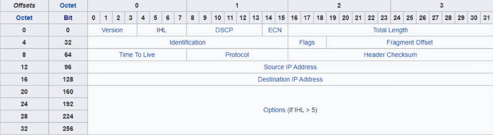
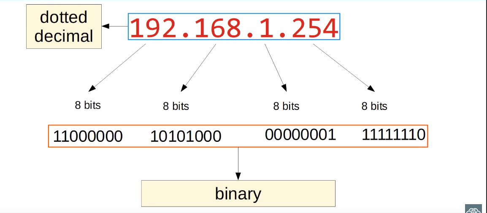
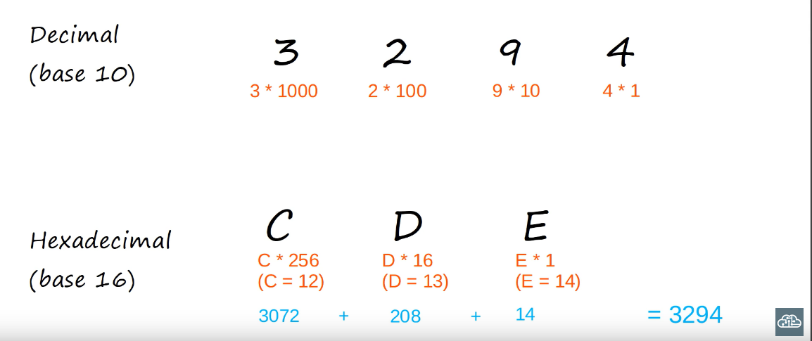
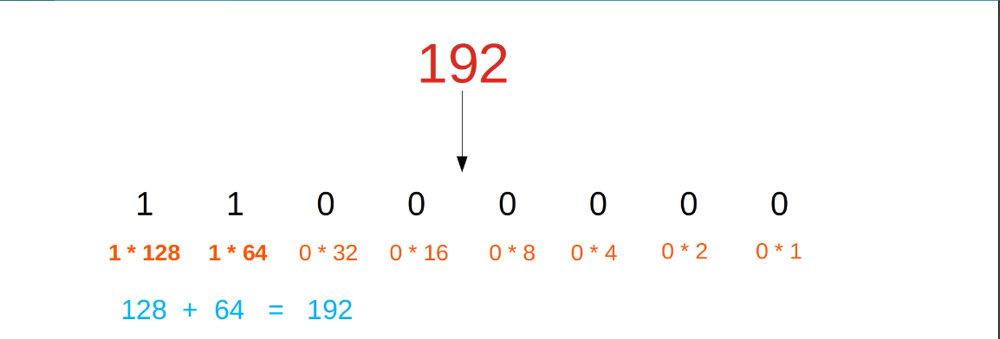
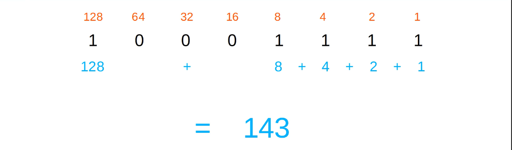

# IPv4 Addressing (Part 1)
### Review: Network Layer
- Provides connectivity between end hosts on different networks (i.e. outside of the LAN)
- Provides logical addressing (IP addresses)
- Provides path selection between source and destination
- Routers operate at Layer 3
### Routing

- In the past lectures, we learned that if SW1 and SW2 were connected to each other, all devices in the diagram would be considered as being part of a single network
- However, with the inclusion of a router between both switches, we would now consider these as being two separate networks

- Each network is assigned its own IP address
- The first 3 groups of numbers, 192.168.1 & 192.168.2, represent the network itself, and only the last 0 changes to represent the end hosts on the network
- The /24 at the end is used to tell what part of the address represents the network, and which part represents the end hosts
- /24 means that the first 3 groups of numbers represents the network
- The router also needs two separate IP addresses that would connect to each network, which in this case will be 192.168.1.254 & 192.168.2.254

- This time, if R1 sends a frame to the broadcast MAC address of all Fs, SW1 will receive the frame, and it will forward it out of all interfaces except the one the frame was received on
- So, it sends the frame out of G0/1 and G0/2, and PC2 and R1 receive the frame
- However, that's where it ends
- The broadcast is limited to the local network, it doesn't cross the router and go to SW2, PC3, & PC4
### IPv4 Header

- Both the source & destination IP addresses are both 32 bits in length, and stretch from 0-31 in this chart
- So, IP addresses are 32-bits or 4 bytes in length
### IPv4 Address

### Decimal & Hexadecimal

### Binary (Base 2)

- It's worth mentioning that we normally refer to each of these 8 bit groups as 'octets'
### Binary -> Decimal (1)
- First, it helps to write out the value of each binary digit over the binary numbers
- You can start with 1 on the right, and then multiple by 2 for each digit as you move to the left
- Or start by writing 128 over the digital to the left and dividing by 2 as you move to the right
- Once you've written these values, simple add up the value of each 1, and you'll get the decimal conversion

