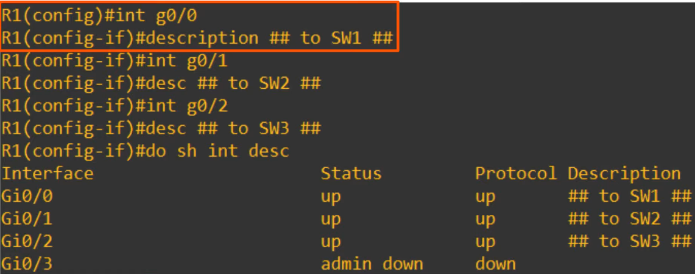

# IPv4 Addressing (Part 2)
### Things We'll Cover
- IPv4 address classes (review, clarification)
- Finding the:
	- max number of hosts
	- network address
	- broadcast address
	- first usable address
	- last usable address
- of a particular network
- Configuring IP addresses on Cisco devices
### IPv4 Address Classes

- When it comes to Class A, different sources say different things regarding the range so it's best to stick to 0-127 to be safe
- But also keep in mind that 1 and 127 are reserved, so really the usable range is 126

### Max Hosts Per Network
- Class C:

- Class B:

- Class A:

- Formula for calculating the max hosts is:

### First/Last Usable Addresses
- Class A:

- Class B:

- Class C:

### IPv4 Addressing
- Diagram of our network with each Class type A-c

- CLI Configuration:

- Column Explanations:
- **Interface:**
	- Lists the network interfaces on the device
- **IP-Address:**
	- Lists the IP address of each interface
	- They are all unassigned by default
- **OK?**
	- A legacy feature of the command and is no longer relevant
	- It basically says whether or not the IP address is valid, however, modern devices won't let you assign invalid IP addresses
	- The interfaces currently have no IP addresses assigned, which is considered a valid state
- **Method:**
	- Indicates the method by which the interface was assigned an IP address
	- Is set to 'unset' by default
- **Status:**
	- **Layer 1** status of the interface
	- If the interface is enabled, there is a cable connected, and the other end of the cable is properly connected to another device, you should see 'up' here
	- However, here it displays 'administratively down' which means the interface has been disabled with the 'shutdown' command
	- Since no configurations have been done on the interfaces yet, this can be considered the default status of Cisco router interfaces
	- Cisco switch interfaces are NOT administratively down by default
	- They'll either be up if connected to another device, or down if they're not connected
- **Protocol:**
	- This is the **Layer 2** status of the interface
	- Since the interfaces are down at Layer 1, Layer 2 can't operate, so all the interfaces are down at Layer 2
	- You'll never see an interface with a 'down' in the status column and 'up' in the protocol column, although the reverse is possible
	- Once we configure these interfaces and enable them, we should see 'up' in both the status and protocol columns
- **Worth Remembering:**
	- **Status** refers to the **Layer 1** status
	- **Protocol** refers to the **Layer 2** status

- Command to enter interface config mode: `interface [interface name]`

- As shown in the `show ip interface brief` command, the GigEthernet0/0 interface has been properly assigned an IP as indicated by the changes in the corresponding columns
### `show interfaces [interface]`

- This command shows primarily Layer 1 and Layer 2 information about the interface, but also some Layer 3
- `GigabitEthernet0/0 is up` = Layer 1 is working
- `line protocol is up` = Layer 2 is working
- `Hardware is iGbe` = 1 Gigabit Ethernet
- `address is 0c1b.8444.f000` = MAC address
- `bia` = burned in address, it lists the address twice as this is the physical address on the device, but you can actually re-configure a different MAC address using the CLI
- `Internet address is 10.255.255.254/8` = IP address
### `show interfaces description`

- Interface descriptions are optional, but can be very helpful in identifying the purpose of each interface
- To be able to add descriptions to an interface, we would do the following:

- The command to configure an interface description is simply `description` followed by the description