# Switch Interfaces
### Things We'll Cover
- Interface speed and duplex
- Speed and duplex autonegotiation
- Interface status
- Interface counters and errors
### Network Topology
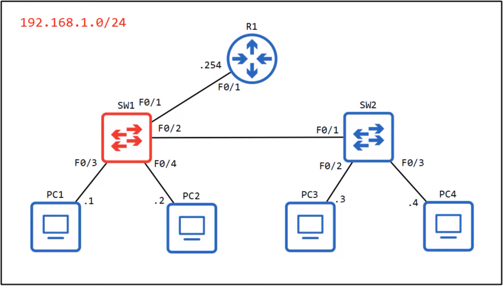
### Router CLI
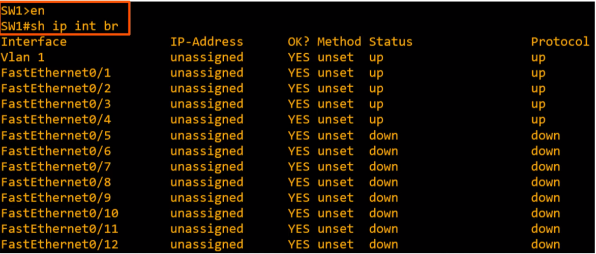
- Even though no configurations have been made yet, since this is a switch, we can see that the first four interfaces that have been connected are already in the 'up' state by default
- Switch interfaces don't have the shutdown command applied, so if you connect them to another device they'll usually be in the up/up state with no configuration required
- The IP address will remain unassigned since these are Layer 2 switch ports that don't need IP addresses
- The other interfaces that aren't connected to any devices are in the down/down state
- down/down is different from administratively down/down
### `show interfaces status`
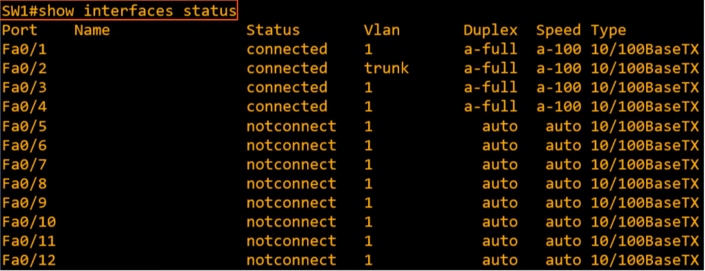
- **Port:** simply lists each interface
- **Name:** Description of the interface
- **Status:** Different from the status field of `show ip interface brief`
- **VLAN:** Will be covered more in depth in a future video, but for now the default state is `1`
- **Duplex:** 
	- Indicates whether the device is capable of both sending and receiving data at the same time **(full-duplex)**, or if it's not **(half-duplex)**
	- Set to `auto` by default, `a-full` means that it automatically negotiated a duplex of `full` with the neighboring device
- **Speed:** 
	- Also `auto` by default
	- These are fastethernet interfaces, so they are capable of speeds up to 100 Mbps, however, they're also capable of speeds of 10 Mbps
	- `auto` means they're able to negotiate with the device they're connected to and use the fastest speed both devices are capable of
	- `a-100` means a speed of 100 Mbps was auto-negotiated with the neighboring device
- **Type:**
	- All RJ45 interfaces for copper UTP cables
	- If they were SFP modules, you'd see that here instead
	- `10/100BaseTX`, the 10/11 refers to the speeds at which these interfaces can operate
### Configuring Interface Speed & Duplex
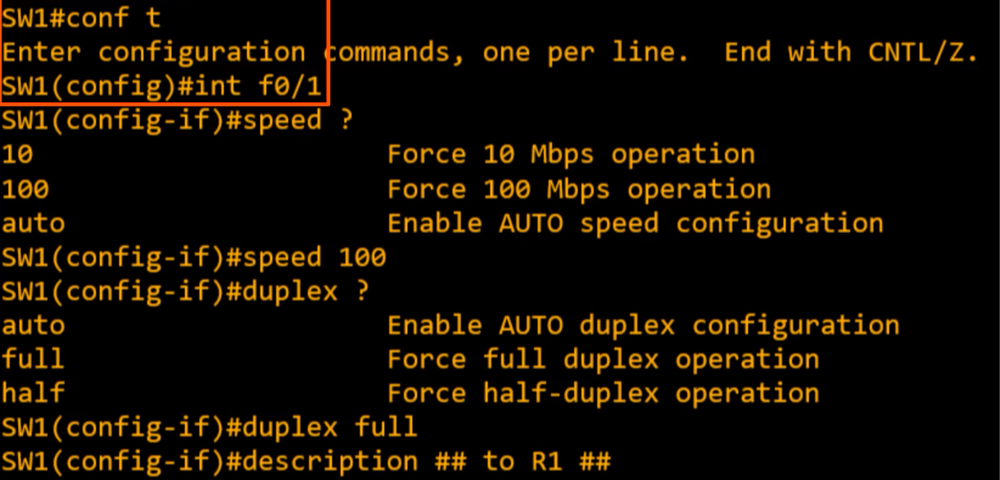
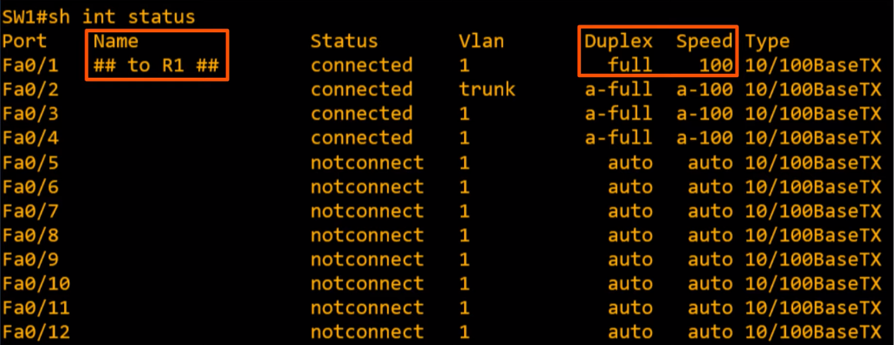
- Here we can see the new changes that were made from manually configuring `Fa0/1`
- Normally, you'd keep autoconfiguration on, but in case it isn't working properly, you should know how to manually configure the speed and duplex of an interface
- Although the fact that switch interfaces are enabled by default is convenient, it can be a security concern
- It's best to disable unused interfaces
- Fortunately, instead of having to configure each of the 8 unused interfaces one by one, there's a way to configure all of them at once
### `interface range`
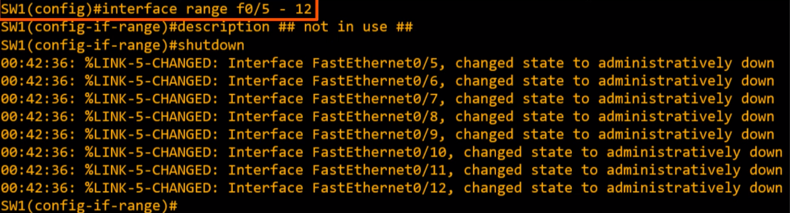
- The `shutdown` command disables the interfaces
- A cool thing about this command is that the interfaces in the range don't all have to be consecutive
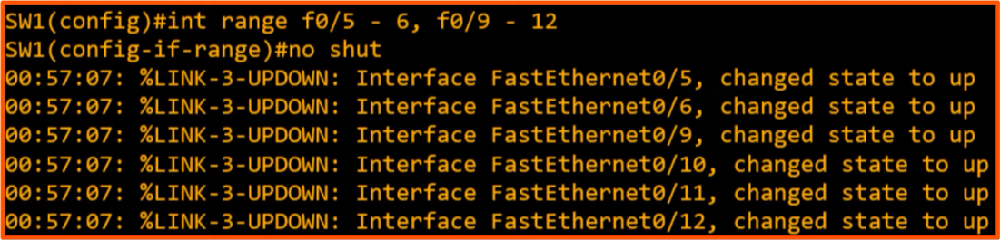
- In this case, `f0/7` and `f0/8` remain shutdown
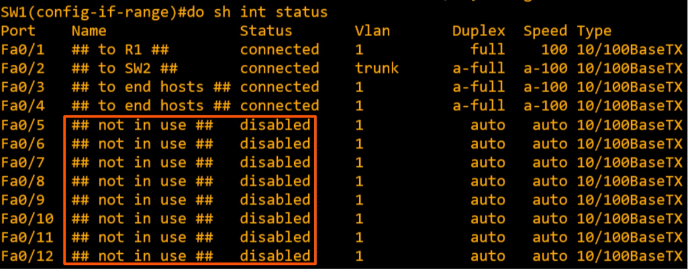
- Here's the new output after making these changes to the other interfaces
### Full/Half Duplex
- **Half Duplex:** 
	- The device cannot send and receive data at the same time
	- If it's receiving a frame, it must wait before sending a frame
- **Full Duplex:**
	- The device **can** send and receive data at the same time
	- It doesn't have to wait
- In modern networks that use switches, all devices can use full duplex on their interfaces
### LAN Hubs
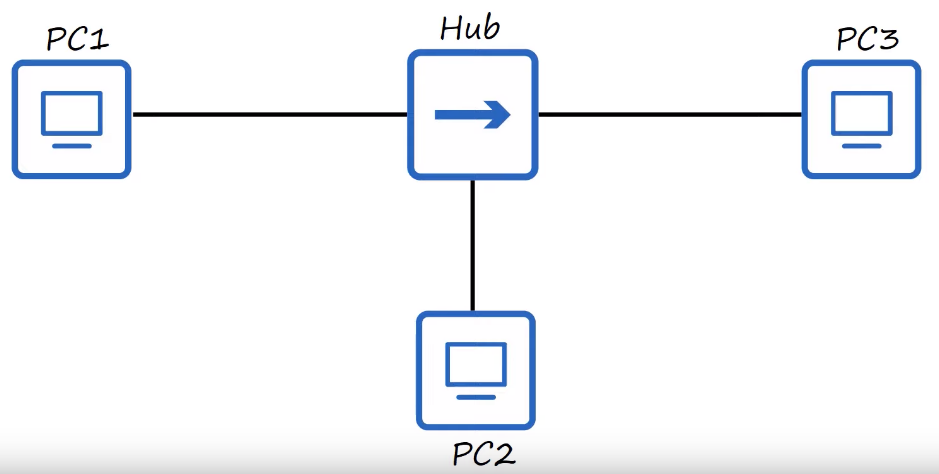
- Hubs came before switches were created and were much simpler, they simply served as a repeater
- Any frame it receives, it floods like a switch does with a broadcast or unknown unicast frame
- For example, if PC1 wants to send a frame to PC2, it will send the frame out of its network interface
- After the hub receives it, it will repeat the frame out of its other interfaces, to PC2 and PC3
- PC3 will recognize that the destination MAC address is not its own and ignore the frame, and PC2 will receive it normally
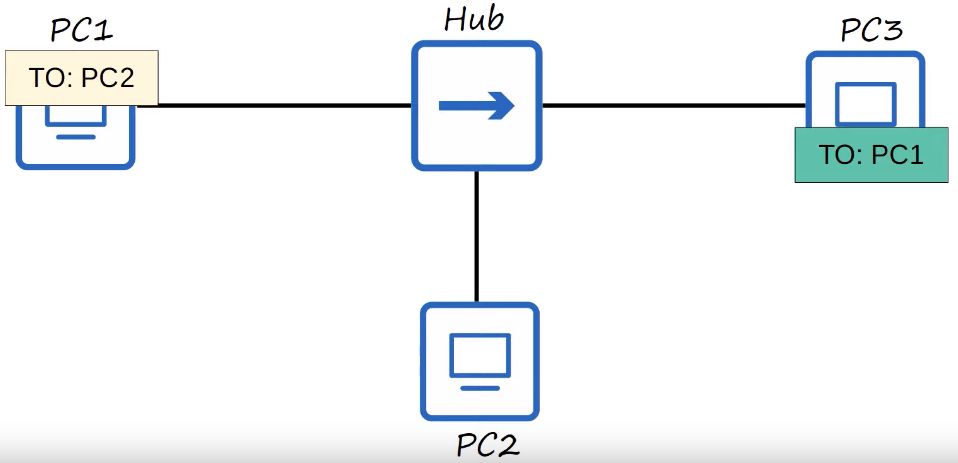
- Now what if two PC's try to send a frame at the same time?
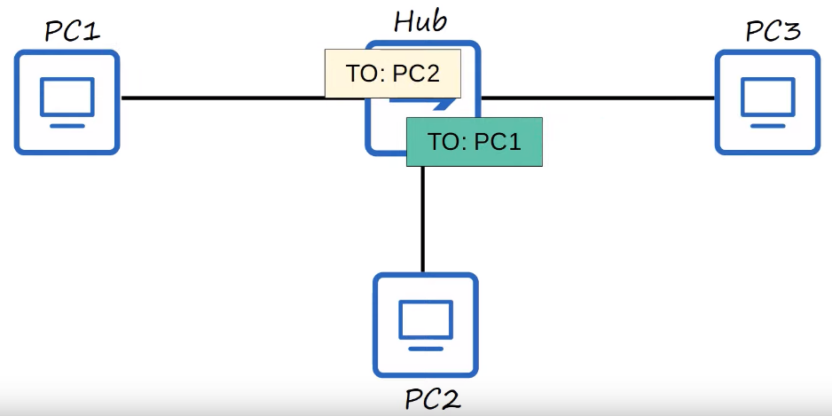
- They both send the frames out of their network interfaces, and this is where a problem occurs
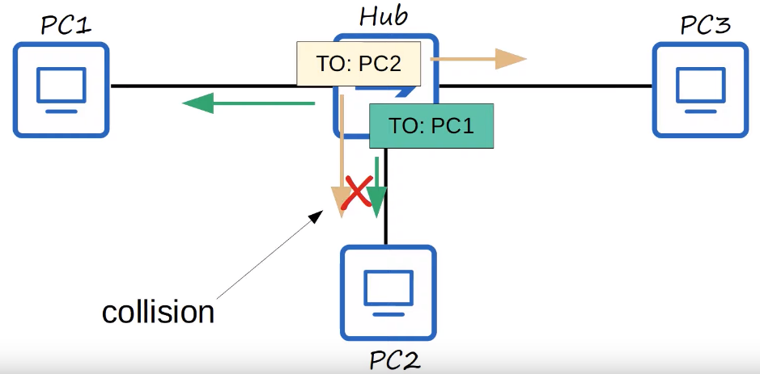
- The hub won't send one first and then send the other after, it simply tries to flood both at the same time
- This results in a collision on the interface, and PC2 will not receive either frame intact
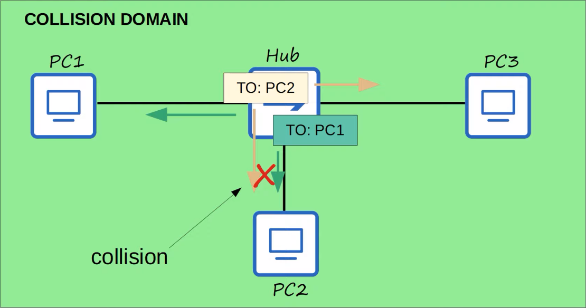
- All devices connected to a hub are part of what's called a collision domain
- The frames they send could collide with frames sent by any of the other devices connected to the hub
- To deal with collisions in a half-duplex situation like this, Ethernet devices use a mechanism called 'CSMA/CD'
### CSMA/CD
- **C**arrier **S**ense **M**ultiple **A**ccess with **C**ollision **D**etection
- Describes how devices avoid collisions in a half-duplex situation, and how they react if collisions do occur
- Before sending frames, devices 'listen' to the collision domain until they detect that other devices are not sending frames
- If a collision does occur, the device sends a jamming signal to inform the other devices that a collision happened
- Each device will wait a random period of time before sending frames again
- The process repeats
### Collision Domains
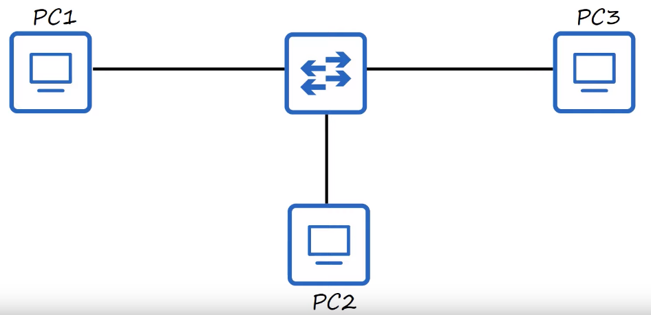
- Switches are more sophisticated than hubs
- Hubs are simple repeaters which operate at Layer 1, repeating whatever signals they receive
- Switches operate at Layer 2, using MAC addresses to send frames to specific hosts
- They also won't try to send two frames to the same host at once
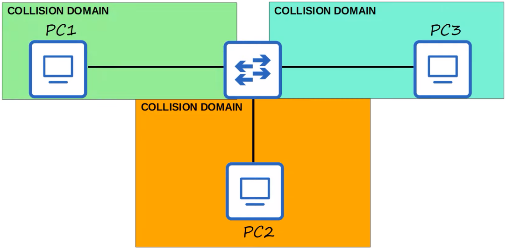
- So this network, which was one collision domain when connected to a hub, is now three collision domains
- Because of the improved functionality over hubs, these devices can now operate in full-duplex, meaning they don't have to worry about whether other devices are sending data at the same time
- Although problems like collisions still do occur, they're rare and usually a sign of a problem, like a misconfiguration, rather than a regular occurrence like in a half-duplex network
### Speed/Duplex Autonegotiation
- Interfaces that can run at different speeds have default settings of `speed auto` and `duplex auto`
- Interfaces 'advertise' their capabilities to the neighboring device, and they negotiate the best `speed` and `duplex` settings they're both capable of
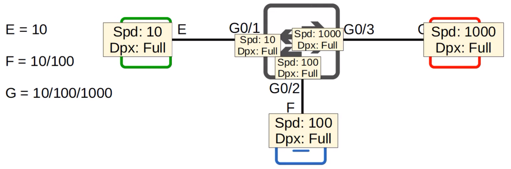
- The PCs are all able to use the max speed of their network interfaces, and the switch adjusts the speed of its interfaces to match
- In a network like this with all PCs and switches, there's no reason to use half-duplex, so they all negotiate to use full-duplex
- What if autonegotiation is disabled on the device connected to the switch?
- **SPEED:**
	- The switch will try to sense the speed that the other device is operating at
	- If it fails to sense the speed, it will use the slowest supported speed (i.e. 10 Mbps on a 10/100/1000 interface)
- **DUPLEX:**
	- If the speed is 10 or 100 Mbps, the switch will use half duplex
	- If the speed is 1000 Mbps or greater, the switch will use full duplex
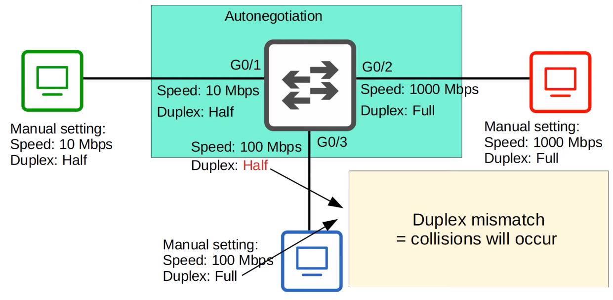
- This is a big reason to use autonegotiation on all devices in the network
### Interface Errors
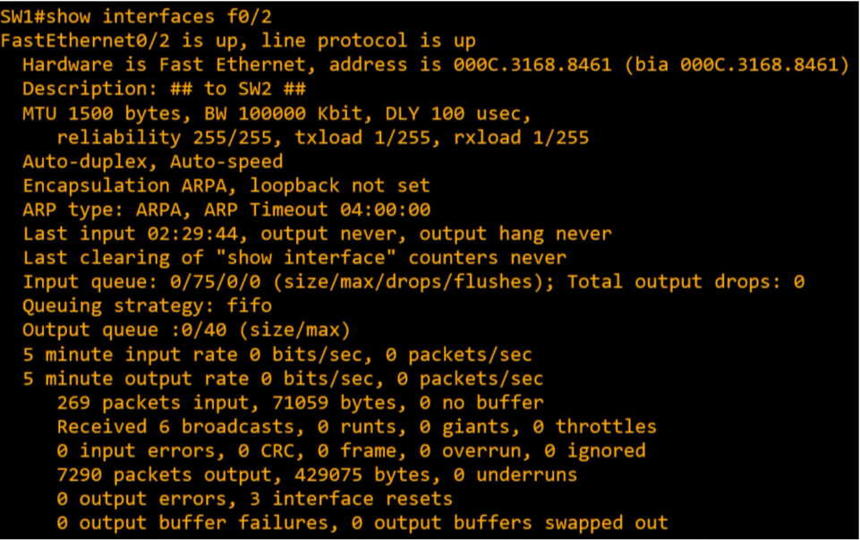
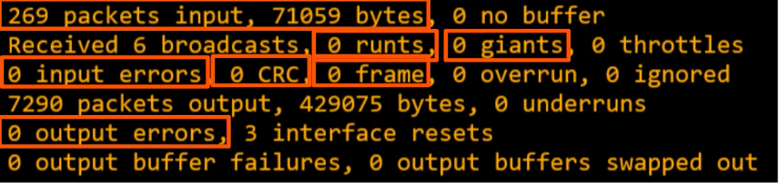
- **Runts:** Frames that are smaller than the minimum frame size (64 bytes)
- **Giants:** Frames that are larger than the maximum frame size (1518 bytes)
- **CRC:** Frames that failed the CRC check (in the Ethernet FCS trailer)
- **Frame:** Frames that have an incorrect format (due to an error)
- **Input Errors:** Total if various counters, such as the above four
- **Output Errors:** Frames the switch tried to send, but failed due to an error